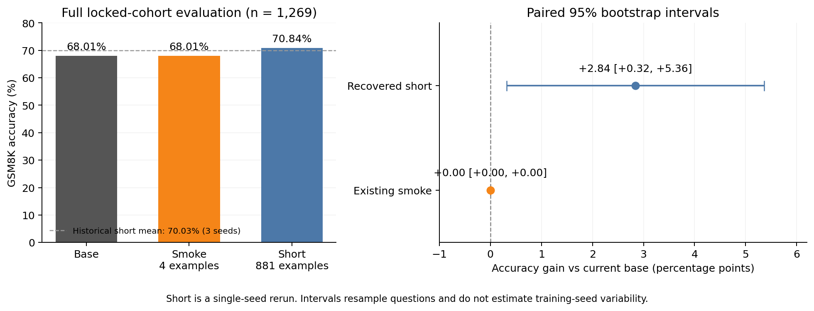
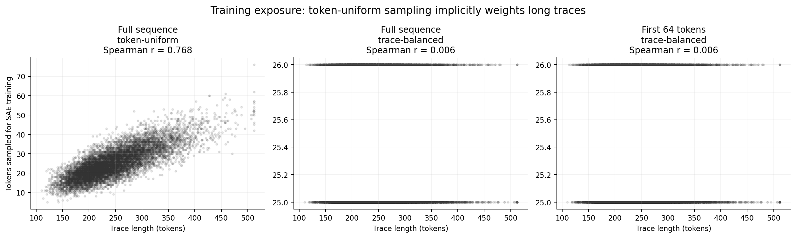
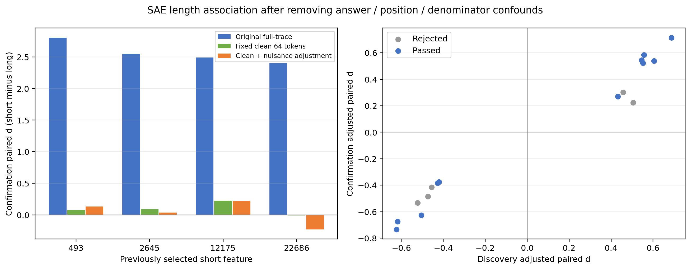

# 项目管理：SAE 长度混淆消融与学生蒸馏

更新时间：2026-09-11（America/New_York）；本次整理 2026-09-10 的实验与最终审计。本文件作为当前任务、阻塞原因与验收条件的统一入口；各实验的冻结协议、原始报告和历史产物保持独立。

## 2026-09-11：本地独立重跑；历史 B3/B4 输入仍缺失

**独立重跑已获明确授权并启动**：用户回复“重跑”。新实验 `phase7_local_full_sequence_rerun_v1` 全部写入 [C31 本地工作区](/mnt/local/youyang7/SAE_long_short_c31/workspaces/continuation_20260911/README.md)，在保留的 allocation `279747` 内使用四张 A6000、每卡一个进程生成 881 题 × 16 候选。冻结 [主配置](/mnt/local/youyang7/SAE_long_short_c31/workspaces/continuation_20260911/configs/phase7_local_full_sequence_rerun_v1.json) 与 [来源绑定](/mnt/local/youyang7/SAE_long_short_c31/workspaces/continuation_20260911/results/phase7_local_full_sequence_rerun_v1/exploratory/protocol/FROZEN.json) 已落盘；保留 617/132/132 划分、六 SAE 的 seeds 17/42/73、全序列 v2 筛选门槛和后续校准门槛。此处是新生成、新训练的独立实验，原 B3/B4 产物的缺失状态不变。候选池、四分片激活、六 SAE 的 1,500 步训练与共同评分均已完成；核心审计通过，逐个核对 3,507,902 个激活 token。全序列筛选得到一组稳定 long 特征；5,376 条配对校准完成，选定 prefix16 / long_suppress=0.5。该轮已完成全题集三条件生成、36 个学生 adapter、37 个完整评估及最终审计；本次重新核对总完成标记绑定的审计、报告和学生汇总哈希通过。[完成报告](/mnt/local/youyang7/SAE_long_short_c31/workspaces/continuation_20260911/results/phase7_local_full_sequence_rerun_v1/exploratory/report_zh.md)。开发集发现也取消 first64 符号与效应排序限制，仅按全序列效应选候选；这是新登记实现，不能称为原 v2 的逐字复现。[生成日志](/mnt/local/youyang7/SAE_long_short_c31/workspaces/continuation_20260911/results/phase7_local_full_sequence_rerun_v1/exploratory/logs/generation_launch.log)。

**新增 feature 数量方案，离线检查完成**：用户提出扩大 E2 干预 feature 集合。独立核对原 E2 dev 排名，full-trace-balanced 的每侧 top64 全部通过原 dev 门槛；joint64 相对 joint16 的 decoder 方向夹角为 40.46°。原 joint16 实为 16 short + 16 long。已形成 [数量扩展与学生收益方案](/mnt/local/youyang7/SAE_long_short_c31/workspaces/continuation_20260911/docs/phase8_feature_breadth_student_gain_proposal_zh.md) 和 [离线分析完成标记](/mnt/local/youyang7/SAE_long_short_c31/workspaces/continuation_20260911/results/phase8_feature_breadth_feasibility_v1/exploratory/OFFLINE_ANALYSIS_COMPLETE.json)。用户已明确要求编辑脚本并执行；独立 `phase8_feature_breadth_intervention_v1` 已冻结并在 C31 四卡启动，顺序完成 smoke、13 条件教师扫描、学生开发集选择和最终多种子两预算评估。[执行入口](/mnt/local/youyang7/SAE_long_short_c31/workspaces/continuation_20260911/docs/phase8_feature_breadth_execution_zh.md)。当前启动不代表实验完成或已获得学生收益。

**本地执行更新**：用户随后要求在 `/mnt/local` 完成实验。已建立 [C31 本地工作区](/mnt/local/youyang7/SAE_long_short_c31/workspaces/continuation_20260911/README.md)，复制代码、legacy 训练源码、三份各 881 条 rank 数据和 1,269 题评估集，并将 `/var/tmp` 保留的固定 revision 7B 教师复制到本地 HF cache。教师四个权重分片、学生权重、数据与评估集登记哈希均通过；教师和学生分别在 GPU 1、2 完成实际加载和简短生成，8 项筛选/缓存测试通过。[本地准备记录](/mnt/local/youyang7/SAE_long_short_c31/workspaces/continuation_20260911/results/local_staging/LOCAL_PREPARATION.json)。7B 路径阻塞已解决；最新本地预检仍缺 23 个筛选文件和 13 个后续生成文件。该准备阶段未启动实验；随后用户明确选择独立重跑，最新执行状态见上一段。

此前的首次续跑预检先核验了尚未完成的 B3/B4 输入。C31 allocation `279747` 内重新执行 B3 预检，结果为 **`blocked_missing_inputs`**：23 个去重后的筛选路径、16 个生成前置路径不可用；后者尚不含教师 index 恢复后才可枚举的权重分片。已安装依赖的版本信息已刷新，其中 TRL 为 0.9.6；该次预检没有完成教师加载或 GPU 实验验证。[首次预检](results/project_continuation_20260911/b3_preflight.json)、[恢复清单与历史哈希参考](results/project_continuation_20260911/recovery_manifest.json)。

C31、C32 和 C49 均未发现 BeeGFS 挂载，原 `phase1_legacy_trace_sae_distillation_v1` 路径不可访问。在已检查的 home、C31 本地目录及 C32/C49 临时目录中未找到可用的原六 SAE、原评分汇总和 mixed corpus 副本；这不代表原存储上的文件已删除。C49 只读检查作业 `280948` 已结束；C30 检查作业 `280947` 因节点不可用一直排队，已撤销该次新建检查，C30 的存储状态未知。用户原有 C31/C32 allocations 和 `gg` 均保持开放。[C31 快照](results/project_continuation_20260911/storage_c31.txt)、[C32 快照](results/project_continuation_20260911/storage_c32.txt)、[C49 快照](results/project_continuation_20260911/storage_c49_280948.txt)、[检查作业状态](results/project_continuation_20260911/storage_jobs.txt)。

**B3 尚未执行筛选，B4 尚未启动生成或训练。** 恢复条件是让原 BeeGFS 实验目录重新可读，或提供包含原评分、六 SAE 和轨迹池的备份根目录；随后按登记哈希验证并运行独立 v2 筛选，再依据词汇反证与校准门槛推进 B4。E2 的三个 SAE 和 2,643 条当前 rank 轨迹不替代 B3/B4 的历史输入。下文 9 月 9 日“输入已恢复”仅代表当日快照，不能用于当前准入。

## 2026-09-10：新增 E2，当前数据的长度控制 SAE 与加强干预

用户已要求完成相关实验并提供 docs 报告。独立实验 `phase6_local_length_controlled_strength_v1` 已从 C31 Arrow 缓存逐字节恢复原 short/medium/long 各 881 条数据，三份 SHA256 与历史审计一致。使用这 2,643 条正确 rank 轨迹重训三个 SAE，不替代历史 14,096 条原始候选池的训练或 B3/B4。

E2 已完整完成：四个提取分片、三个 SAE 的 1,500 步训练、共同位置评分、27 条件教师扫描（3,456 条）、结构匹配随机补充（384 条）、881 题四候选三条件生成（10,572 条），以及共同 873 题上四条件、两预算的 8 组学生训练和各 1,269 题评估。完成标记、201 项输入/模型哈希检查、逐题完整性审计、图表和展示复核均已落盘。使用 C31/C32 保留的 allocations `279747`、`280415`，keepalive 保持开放；新数据与最终 checkpoint 位于 home，临时激活留 C31 `/mnt/local`。

结论：按轨迹等权采样基本消除长度曝光偏差；选定 short16/long16 联合方向、30% 范数、start0 的干预在全量候选中缩短输出 20.00%，但正确候选率从 98.89% 降至 96.34%。学生等样本为 SAE 69.66% / 无干预 69.35%，等 token 为 SAE 70.37% / 无干预 70.53%；六个计划配对比较的 95% 区间均跨零，未确立学生涨点。同数据、同 seed 的随机对照重复运行仍相差 1.34 个百分点，模型权重和早期训练日志已不同；原配方未开启严格确定性，具体底层原因未隔离，不能将单次执行的微小差值解释为稳定收益。

最终交付：[E2 中文实验报告（展示复核版）](docs/phase6_local_length_controlled_strength_report_zh_v2.md)、[英文一页 PPT 文字](docs/sae_representation_one_slide_en.md)、[完成标记](results/phase6_local_length_controlled_strength_v1/exploratory/EXPERIMENT_COMPLETE.json)、[完整审计](results/phase6_local_length_controlled_strength_v1/exploratory/FINAL_AUDIT.json)、[展示复核](results/phase6_local_length_controlled_strength_v1/exploratory/PRESENTATION_REVIEW_COMPLETE.json)。保留单种子、当前已观察数据的探索性边界；E2 不替代历史 B3/B4 协议。

### E2 关键结果与证据

- **长度控制 SAE**：三个 SAE 的实际训练曝光与轨迹长度的 Spearman 相关为 0.9458 / −0.0146 / −0.0146；共同完整测试轨迹的重构 explained variance 为 0.7741 / 0.7738 / 0.6582。轨迹等权明显降低曝光偏差，prefix64 的优势限于早期位置，不能由重构指标推断学生准确率。[实际曝光审计](results/phase6_local_length_controlled_strength_v1/exploratory/training_exposure_audit.json)
- **教师干预**：dev 选定 `full_trace_balanced__joint16__rho0.3__start0`。在另外 64 题上，平均长度从 261.61 降至 198.75 tokens（−24.03%），正确题数从 63 降至 62；这不证明正确率无损。全量 881 题、每条件四候选生成中，长度从 250.07 降至 200.06 tokens（−20.00%），正确候选率下降 2.55 个百分点，按题配对 95% 区间为 [−3.52, −1.62]。[全量教师统计](results/phase6_local_length_controlled_strength_v1/exploratory/student_followup/teacher_data_summary.json)
- **学生蒸馏**：三个生成条件分别有 880 / 874 / 881 题具备正确完整候选，最终四条件共同支持为 873/881 题（99.09%）；原自然 short 也在同一支持集重训。seed 17 下完成四条件 × 两预算的 8 个 adapter，各评估 1,269 题。[共同支持与预算](results/phase6_local_length_controlled_strength_v1/exploratory/student_followup/DATA_COMPLETE.json)

| 预算 | 无干预 | SAE 联合干预 | 匹配随机 | 同题集原自然 short | SAE − 无干预，百分点 [95% CI] |
| --- | ---: | ---: | ---: | ---: | --- |
| 等样本 | 69.35% | 69.66% | 69.90% | 69.98% | +0.32 [−2.13, +2.76] |
| 等目标 token | 70.53% | 70.37% | 71.24% | 70.84% | −0.16 [−2.52, +2.21] |

六个计划配对比较的区间均跨零，Holm 校正 p 值均为 1.0000；未确立 SAE 学生准确率收益。区间只覆盖评估题目重采样，不包含训练种子或执行变异。等 token 使用完整轨迹重复，优化步数与题目权重不相等。[学生指标与全部配对比较](results/phase6_local_length_controlled_strength_v1/exploratory/student_followup/STUDENT_COMPLETE.json)

**复现限制与归档状态**：同数据、同初始化、同 seed 的两次随机对照分别答对 887 与 904 题，95 题的正确状态不同；差异已出现在训练阶段，底层原因尚未隔离。两次执行不构成跨种子复现，也不能解释为预算收益。[重复对照审计](results/phase6_local_length_controlled_strength_v1/exploratory/student_followup/repeated_control_audit.json)。总完成标记时间为 2026-09-10 13:00:11（America/New_York）；`formal_claim_allowed=false`。本次文档整理重新核对了完成标记绑定的最终审计、原报告，以及展示复核绑定的完成标记和 v2 报告 SHA256，全部一致；201 项输入/模型检查引用昨日最终审计，未在本次重新执行全量模型核验。

## 当前结论

**历史长度采样消融、有效配方 SFT 复现和六个 SAE 已完成；9 月 10 日新增 E1 原 short 复查与 E2 长度控制 SAE → 干预生成 → 学生对照也均已完成。E2 实现了有正确率代价的教师压缩，尚未确立学生准确率提升。历史 B3 全序列重筛选和 B4 对应协议的干预蒸馏仍未完成。**

这里的“分数”指 GSM8K `test[50:1319]` 的 1,269 题答案正确率，不能用训练 loss 下降代替。历史 short SFT 的点估计高于 base，但相对 base 的配对区间仍跨零，不能写成已确立显著收益。

**新增 E1 已完成：本地环境使用恢复的原 881 题 short 数据训练，seed 17 达到 70.84%，相对同环境 base 68.01% 提升 2.84 个百分点。** 原四样本 smoke adapter 仍为 68.01%，没有有效权重更新。此单种子结果与上文历史三种子均值分开报告。

2026-09-09 的 BeeGFS 读写和关键产物哈希核验通过；2026-09-10 重新检查时，C31、C32 均未挂载 BeeGFS。E1 通过节点缓存恢复数据并完成训练评估；历史 SAE / 干预分支未因此自动续跑。

## 2026-09-10：本地数据与 short 涨点验证

用户希望确认 `/mnt/local` 的数据能否达到历史 short 70.03% 附近及其涨点幅度。原本本地只有 4 样本、1 步的环境测试 adapter，数据路径实际指向 home 中的 Phase-0 smoke 数据；不存在一份已经完成全量重生成与评估的本地 short 数据集。

已从 C31 `/var/tmp` 保留的 Arrow 缓存恢复原 881 题 short JSONL，SHA256 与历史文件完全一致；从 home 保留预测的 **gold 字段**恢复 1,269 题评估输入，其 SHA256 也与原 fixture 完全一致。没有使用模型预测答案作 gold。

E1 使用 `/mnt/local/youyang7/SAE_long_short_c31` 环境，在现有 C31 allocation `279747` 内并行完成 base、原本地 smoke adapter、新 short seed-17 adapter 三个条件。新训练复用原 legacy TRL 配方，实际完成 1 epoch / 221 steps；评估固定 `test[50:1319]`、batch 32、greedy、512-token cap。数据和最终 adapter 已发布到 home 项目内，新实验的本地临时目录已清理。

| 条件 | 正确题数 / 1,269 | 正确率 | 相对同环境 base |
| --- | ---: | ---: | ---: |
| Base | 863 | 68.01% | — |
| 原四样本 smoke adapter | 863 | 68.01% | 0.00 个百分点 |
| 原 881 题 short，seed 17 | 899 | **70.84%** | **+2.84 个百分点** |

Short 净多答对 36 题；配对题目 bootstrap 95% 区间为 **[+0.32, +5.36] 个百分点**，区间不包含训练种子变异。70.84% 比历史三种子均值 70.03% 高 0.81 个百分点，但不能据此声称单种子方案优于历史三种子协议。平均输出长度为 short 264.85、base 241.89 tokens，本轮涨点没有伴随相对 base 的输出缩短。

旧 smoke 的 196 个 LoRA-B 张量全部为零，其完整预测与 base 逐字节一致。源代码与单步学习率检查确认：warmup steps = ceil(0.03 × 1) = 1，唯一一次 optimizer.step 的学习率为 0，故没有产生有效 LoRA 更新；这不证明四条数据在正常训练下无效。[诊断证据](results/phase1_local_short_gain_check_v1/adapter_effect_diagnostic.json)

当前状态：**训练、三个完整评估、逐题审计和配对分析已完成**。这是一轮单种子原数据恢复复查，D1 的候选全量重生成仍未执行。

- [冻结配置](configs/phase1_local_short_gain_check_v1.json)
- [恢复数据与源码证据](results/phase1_local_short_gain_check_v1/IMPORT_COMPLETE.json)
- [运行日志](results/phase1_local_short_gain_check_v1/logs/launch.log)
- [结果与置信区间](results/phase1_local_short_gain_check_v1/analysis/report.md)
- [完成标记](results/phase1_local_short_gain_check_v1/LOCAL_SHORT_GAIN_CHECK_COMPLETE)
- [恢复的 881 题 short 数据](results/phase1_local_short_gain_check_v1/imported/sft/short.jsonl)
- [可用 adapter](checkpoints/phase1_local_short_gain_check_v1/short__seed_17)

## 任务看板

| ID | 任务 | 当前状态 | 已有证据 / 尚缺什么 |
| --- | --- | --- | --- |
| A1 | 控制长 trace 在 SAE 训练中的采样权重 | **已完成**，2026-09-04 | 三种采样条件，原字典加两个新字典；[采样消融审计](results/phase2_sae_sampling_ablation_v1/exploratory/audit/sae_sampling_ablation_audit.json)通过 |
| A2 | 去掉答案、末尾位置与长度分母后的特征检验 | **按门槛结束**，2026-09-05 | 清理后筛选和两版激活读回完成；随机对照覆盖率失败，独立生成与 SFT 未触发；[Phase 5 最终审计](results/phase5_sae_clean_feature_causal_v1/exploratory/final_audit.json) |
| B1 | 历史有效数据与原 SFT 配方复现 | **已完成，复现门槛通过**，2026-09-05 | 881 题、short/medium/long × seeds 17/42/73，共 9 个 adapter 和完整评估；[复现报告](results/phase1_legacy_trace_sae_distillation_v1/replication/analysis/replication_report.json) |
| B2 | 在 B1 对应原始轨迹池上做 SAE 采样消融 | **已完成**，2026-09-05 | full-trace / prefix64 trace-balanced × 3 seeds，共 6 个 SAE；[完成标记](results/phase1_legacy_trace_sae_distillation_v1/sae/SAE_TRAINING_AND_SCORING_COMPLETE) |
| B3 | 取消 first64 同向准入条件的 v2 重筛选 | **当前缺输入，实验未执行** | 9 月 11 日重新预检：23 个筛选路径不可用，BeeGFS 未挂载；[当前预检](results/project_continuation_20260911/b3_preflight.json)、[v2 协议说明](docs/phase1_full_sequence_screen_c31_v2.md) |
| B4 | 有效配方上的干预数据 vs 自然数据 SFT | **未启动** | 仍缺特征筛选、词汇反证、因果校准、全题集候选生成与共同支持集；[原停止记录](results/phase1_legacy_trace_sae_distillation_v1/intervention_calibration_v1/NO_STABLE_FEATURES.json) |
| C1 | 早期 SAE 干预蒸馏 pilot | **已完成，无稳健改善证据**，2026-09-04 | 24 个 adapter、25 组评估；不能代替 B4；[最终审计](results/phase3_sae_intervention_distillation_pilot_v1/exploratory/final_audit/final_audit.json) |
| C2 | 增大教师干预强度的 sweep | **已完成，零条件通过缩短筛选**，2026-09-05 | 768 条输出，8 个完整分片；未包含新 SFT；[分析清单](results/phase3_sae_intervention_strength_sweep_v2/exploratory/strength_analysis/strength_analysis_manifest.json) |
| D1 | 停机期间提出的全量重生成 + 单种子三个 rank adapter | **待执行，未发现产物** | 已明确三种长度、候选不足按共同有效子集继续；具体 seed 与评估范围未获得上一轮回答，不记作已冻结 |
| E1 | 本地环境复查原 881 题 short 与四样本 smoke 的涨点 | **已完成**，2026-09-10 | Short 70.84%，base / smoke 68.01%；净涨 2.84 个百分点，单种子配对区间 [+0.32, +5.36] |
| E2 | 当前正确 rank 数据的长度控制 SAE、加强干预与学生蒸馏 | **已完成，探索性**，2026-09-10 | 3 个 SAE、教师扫描及结构匹配对照、10,572 条新候选、873 题共同支持、8 个学生及完整评估；教师缩短 20.00% 并损失 2.55 个百分点正确候选率，学生涨点未确立；[最终审计](results/phase6_local_length_controlled_strength_v1/exploratory/FINAL_AUDIT.json) |

### A1：长度采样消融实际回答了什么

三种 SAE 使用相同 layer 17、28,672 features、TopK 64、seed 17、250,000 个训练 token、1,500 steps。改变的是抽样方式，没有把长度标签或显式长度惩罚放进 SAE loss。

- `full_token_uniform`：整段 token 均匀抽样，长 trace 有更多机会进入训练。
- `full_trace_balanced`：先平衡各 trace 的训练贡献，再抽取位置。
- `prefix64_trace_balanced`：平衡 trace，并只从前 64 个位置抽样。

长度与训练抽样量的 Spearman 相关从 **0.768 降到 0.006**。在共同完整测试轨迹上，重构 explained variance 分别为 **0.7765 / 0.7763 / 0.6796**；只看共同 first64 位置则为 **0.7743 / 0.7748 / 0.7943**。prefix64 的重构优势局限于早期位置，不能把不同评价分布的数值直接比较为总体优劣。

三个字典间严格稳定匹配的候选数为 **0**。因此，采样消融已完成，但其结果不能证明某个 short-associated feature 是“简洁推理能力”。[原始结果与解释](results/phase2_sae_sampling_ablation_v1/exploratory/analysis/analysis_report.md)

### A2：Answer 混淆进一步如何处理

原观察中，答案结尾处近似相同的局部激活，除以不同的整段长度后，就可能形成 short/long 差异。这是需要验证的混淆机制，并非全部效应的既定解释。[原 token 与位置诊断](docs/tutorial/sae_training_and_feature_to_token_zh.md)

Phase 5 排除了 `Answer:` 答案段、最后 32 个 token 和格式 token；在前 128 个原始位置内，每条保留恰好 64 个合格早期 token，以固定分母评分，同时保留协变量校正前后结果。

- 2,047 条轨迹、131,008 个状态完成编码；11 个候选通过确认，按 dev 排名预定主特征 **24086**。
- 旧四个短特征的清理后效应量为 **0.079、0.091、0.223、−0.009**，比原整段指标约 2.5–2.8 小很多；由于同时改变了支持位置和清理规则，尚不能分解每个因素的独立贡献。
- 主特征的激活读回操作通过，但第二版随机对照 3739 的确认集覆盖率为 **4.15% < 5%**，未达到预设门槛。因此生成与学生蒸馏未触发。

这轮是“按协议完成并停在失败门槛”，不是“已完成生成且证明长度控制无效”。特征 24086 绑定 Phase 2 的 full-trace-balanced 字典；它与 B2 三种子新字典的 feature ID 不能互换。[完整结果](results/phase5_sae_clean_feature_causal_v1/exploratory/pilot_summary_zh.md)

### B1–B4：使用有效训练数据的对比，做到哪一步

B1 使用逐字节复制的原始三份 881 题 SFT 数据，保留原 completion-only TRL 0.9.6 配方：Qwen2.5-1.5B-Instruct 学生、1 epoch、batch 4、lr 2e-5、rank-4 LoRA、最大输入长度 2048。三种子完整评估结果如下。

| 条件 | 平均 GSM8K 正确率 | 相对该次 C31 base |
| --- | ---: | ---: |
| C31 base | 68.01% | — |
| Short | **70.03%** | +2.02 个百分点 |
| Medium | 68.90% | +0.89 个百分点 |
| Long | 67.38% | −0.63 个百分点 |

登记的复现门槛通过；short − long 的配对 95% bootstrap 区间为 **[+0.53, +4.81] 个百分点**，short − base 为 **[−0.32, +4.31] 个百分点**。所以这里确认了预设复现门槛和 short 高于 long 的探索性证据，尚不能称相对 base 的提升显著。C49 另有 **67.14%** 的 base 回放，逐题复现旧预测；两份 base 均保留，未替换主要基线。[指标、区间和逐 run 记录](results/phase1_legacy_trace_sae_distillation_v1/replication/analysis/replication_report.json)

B2 随后使用同一 881 题、14,096 条原始 7B 轨迹池，完成 full-trace-balanced / prefix64-trace-balanced × seeds 17/42/73 六个 SAE 和跨种子评分。原组合筛选要求全序列与 first64 方向均复制，最终稳定特征数为 **0**。

其中 full-sequence long 候选跨种子对应 **10498 / 18161 / 20175**，但 seed 73 的 first64 方向未通过。已批准的 B3 将 first64 保留为诊断，不再作为准入条件；其实际重筛选仍未运行，不能凭记忆中的 feature ID 直接进入干预。[六模型汇总](results/phase1_legacy_trace_sae_distillation_v1/sae/analysis/sae_summary.json)、[筛选诊断](results/phase1_legacy_trace_sae_distillation_v1/sae/feature_screen_diagnostics/README.md)

**B4 尚无结果。** 需要通过词汇反证与配对缓存校准，再按注册设计对全部 881 题、每方法每题 16 个候选生成，选择 shortest-correct，取所有方法的正确共同题集；历史自然 rank 控制也必须在同一交集重新训练。等样本与等监督 token 结果分别报告，不能把 617 题 SAE 学习划分当作学生训练题数上限。[后续协议](docs/phase1_legacy_trace_sae_distillation.md)

### C1：为什么早期完成的 SFT 不能代替 B4

早期 pilot 在 617 道生成题中取了 613 道共同有效题，采用当时的训练实现，而非 B1 恢复的原 legacy TRL 配方。它包含无干预、short 特征增强、long 特征抑制、随机特征增强 × 两种预算 × 三种子，共 **24 次 SFT**；25 组评估包括 base。

等样本时，无干预为 **65.06%**，short 增强 **64.78%**，long 抑制 **65.30%**；均低于该 pilot 的 **67.14% base**。等监督 token 下也未发现稳健改善，目标干预相对无干预的登记配对区间均跨零。教师平均长度变化也很小。该历史 pilot 不能证明有效配方上的学生收益；新增 E2 已使用 E1 验证的有效配方完成干预学生对照，仍未确立涨点，详见上文。[pilot 分析与判定](results/phase3_sae_intervention_distillation_pilot_v1/exploratory/analysis/analysis_report.json)

## 2026-09-09 恢复与资源快照

- **BeeGFS**：已挂载为读写；4 KiB 新建文件经过 write、fsync、read-back 一致性检查，随后删除。此次关键产物读取和哈希核验通过，不代表对全部文件系统完成完整性检查。
- **证据校验**：331 次文件哈希计算，覆盖 303 个不同路径；其中 303 次比对登记哈希，覆盖 275 个不同路径，全部一致。40 项题目数量、唯一 ID / 共同支持检查全部通过。涵盖三条件采样 SAE、六个后续 SAE、9 个复现 adapter、24 个旧 pilot adapter，以及相关完整预测。[本次机器可读审计](results/project_status_audit_20260909/audit.json)
- **恢复的输入**：六 SAE 检查点、评分、mixed corpus、原 SFT 数据已可读；BeeGFS 固定 revision `a09a35458c702b33eeacc393d103063234e8bc28` 的 7B 配置、tokenizer、四个权重分片存在且可做初始读取。本次未完整加载教师或重跑 GPU 生成。
- **剩余路径问题**：B3 原配置仍指向缺失的 C31 本地 7B snapshot。筛选输入已齐，但按未修改配置做生成仍不满足输入检查。后续应在独立运行配置中绑定恢复的固定 revision，或先将其校验后暂存到节点本地。[恢复后路径审计](results/project_status_audit_20260909/recovery_prerequisites.json)
- **作业状态**：查询时只见用户 `parser` allocation：C31 `279747` 正在运行，C32 `280415` 排队；未见 SAE / SFT 实验作业。C31 GPU 快照只有用户的 `gg` keepalive，四卡剩余显存约 46.1–47.4 GiB。本次未修改任何 allocation 或 GPU 进程。[队列](results/project_status_audit_20260909/queue.txt)、[近期作业](results/project_status_audit_20260909/recent_jobs.txt)、[GPU 快照](results/project_status_audit_20260909/nvidia_smi.txt)
- **存储约束**：保留用户最新选择：新数据实际放在 `/home/youyang7/projects/SAE_long_short` 的独立结果目录；最终 adapter 优先项目目录，配额不足再用 `/mnt/local` 并登记实际位置。已存在的 BeeGFS 历史产物保持原位。本次 home 用量 29,899 MiB / soft quota 39,936 MiB，约余 9.8 GiB；环境、模型暂存、临时状态留节点本地，结束后清理不再需要的临时文件。[配额快照](results/project_status_audit_20260909/quota.txt)

## 下一步与验收条件

以下是待办与历史验收记录，不代表已提交新作业。E1/E2 已完成归档；后续优先解决 E2 已观察到的训练执行差异，再评估独立复现。历史 B3/B4 保留独立队列。

| 优先级 | 工作 | 完成条件 |
| --- | --- | --- |
| 当前阻塞，9 月 11 日已重检 | 恢复 BeeGFS 历史输入与关键证据 | C31/C32/C49 未挂载；需恢复原目录或哈希可验证备份，然后重新验证可读性和登记哈希 |
| P1，待设计 | E2 训练执行差异定位与确定性复查 | 单独冻结复查配置，固定数据、初始化和执行环境；保存逐步日志、权重哈希与完整预测，区分训练和评估变异，不覆盖原 8 次运行 |
| P1 | 执行 B3 全序列 v2 重筛选 | 校验原候选与评分来源；独立输出筛选报告、输入/配置哈希和完成标记；保留原零特征结论 |
| P1，后续启动前 | 重新验证运行环境与固定 7B 路径 | legacy TRL 依赖、教师/SAE 维度、权重与实际 GPU 准入检查通过；旧预检不作为当前通过证据 |
| P2 | 对 B3 入选特征完成词汇反证和配对因果校准 | 目标读回、独立缓存、首个续写 token 干预、正确率/长度/扰动及随机对照审计通过；没有入选特征则记录阴性结果 |
| P3 | 完成 B4 的数据生成和自然数据学生对照 | 全题集完整分片、无重复/缺失；共同支持集一致；最终 adapter、逐题预测、预算统计、配对分析及完成标记齐全 |
| 独立分支 | D1 全量重生成与三个 rank adapter | 每题 16 候选，至少三个唯一正确答案后选 shortest / lower-median / longest；不足时剔除该题并在共同子集训练。冻结单种子配置并记录新数据哈希，不称逐字节复现；建议 seed 17 和完整锁定评估，当前仅为默认建议 |
| E2 已完成；独立确认待设计 | Phase 6 长度干预后续 | E2 已完成从首个输出 logit 干预、实际范数控制、结构匹配随机对照和学生对照；下一轮需独立数据、跨训练种子与更多随机方向复现，并预先冻结正确率代价和学生收益门槛。不得把 Phase 5 的失败门槛改成通过 |

Phase 5 / Phase 6 是独立的清理特征因果验证路线；B3 / B4 是历史有效配方上的全序列特征路线。前者的“固定早期支持检验”和后者的“first64 仅作诊断”不合并成同一筛选规则。

## 更新约定

每次推进只在本文件更新任务状态、日期、作业 ID、实际输出路径、阻塞原因与证据链接。`已完成` 必须指向相应阶段的完成标记和可验证产物；`按门槛结束` 同时写清未触发的后续阶段。既有 GSM8K 旧池结果继续标为探索性，尚无“SAE 干预稳定缩短输出并提升学生”的闭环结论。

2026-09-07 的 [C31 v2 记录](docs/phase1_full_sequence_screen_c31_v2.md) 和 [Phase 6 预检记录](docs/phase6_sae_length_runtime_validation_zh.md) 中的 BeeGFS 停机描述是当时快照；2026-09-09 审计记录它曾恢复。最近资源与输入检查为本文开头的 2026-09-11 续跑预检，C31/C32/C49 未挂载 BeeGFS。历史 BeeGFS 链接需待重新挂载后访问；E1/E2 的数据、最终 adapter 与结果已存入 home。更早的 Phase 0 暂停及 teaching-utility 分支不因本次建账而恢复执行。
