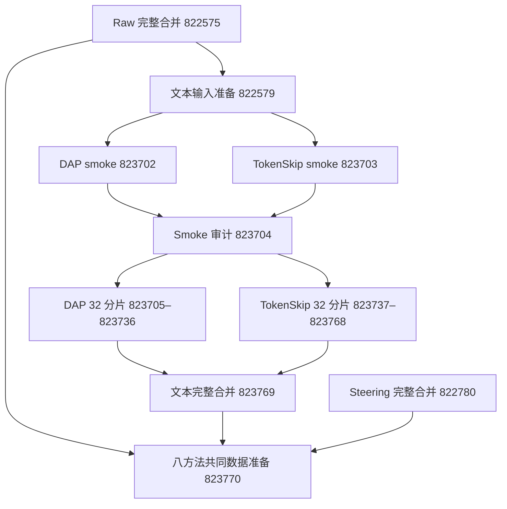

# Phase 13：主池压缩与共同训练数据的依赖流程

`configs/phase13_unified_pipeline_v1.json` 和 `13_43_submit_unified_compression.py` 接续已提交的真实主池数据生成。复用原冻结的 `13_31_compress_math_candidates.py` 执行 DAP/TokenSkip，复用 `13_35_distill_unified_students.py` 构造全部八方法共同支持；新模块只负责受限 DAG、Slurm 依赖和提交来源记录。

本流程包含 69 个作业，未提交学生训练或评测。raw 完整合并 `822575`、steering 完整合并 `822780` 和原文本输入准备 `822579` 为外部父节点。文件未来才生成时，作业使用明确的未来冻结路径；现有 wrapper 在提交时由 Slurm 保存，成功依赖满足后由 worker 重核输入和源码。

2026-09-13 后续参考完整性审计发现多答案等提取缺口，原文本准备 `822579` 已在尚未启动时 user hold。下游 69 节点保持等待；需要绑定修订后的参考及统一重评分结果再迁移/恢复流程，不能直接释放旧输入继续执行。当前 raw/steered 生成保留，旧合并与评分须标记 v2 历史结果。见 [完整性暂停及恢复条件](phase13_math_reference_integrity_v1.md)。

DAP 固定 H200、最多四分片并发；TokenSkip 固定 L40S、单分片顺序执行。所有完整分片依赖两个 smoke 的合并审计，每条并发 lane 后续分片依赖其前一个分片。最终文本合并显式依赖全部 64 个分片；共同数据准备显式依赖 raw、steering、text 三个完整合并。不能用尚未完成的 shard、相似问题或部分方法替代父产物。

八项测试 `823697` 已通过：包括图的全部节点/分片、缺失依赖与重复节点、并发上限、禁止混入训练节点，以及原共同数据的五项反例检查。launch 的 488 项绑定与提交记录的 144 项绑定通过，69 个作业均在 Slurm 中存在，关键依赖已读取核对。提交完成标记只证明调度命令已提交，不证明压缩或 SFT 数据完成。

每次 `sbatch` 调用前保存 intent，成功后记录真实 job ID 与原始响应；不自动重试不确定的提交，不覆盖已有 DAG。运行失败需核实具体终态、保留原尝试再处理。原三个上游作业保持原 ID 和科学配置。

待所有父数据完整后，SFT 准备将重选 B0–B7、报告完整池覆盖和共同支持、核验两学生 tokenizer 的全部 supervision tokens、冻结真实题数。训练仍是单独阶段。当前源码同时加入 job-local scratch 容量检查，记录可用空间和估算需求，避免 GPU 显存检查通过后因临时存储不足丢失最终 adapter；这不改变训练超参数或历史冻结代码。
