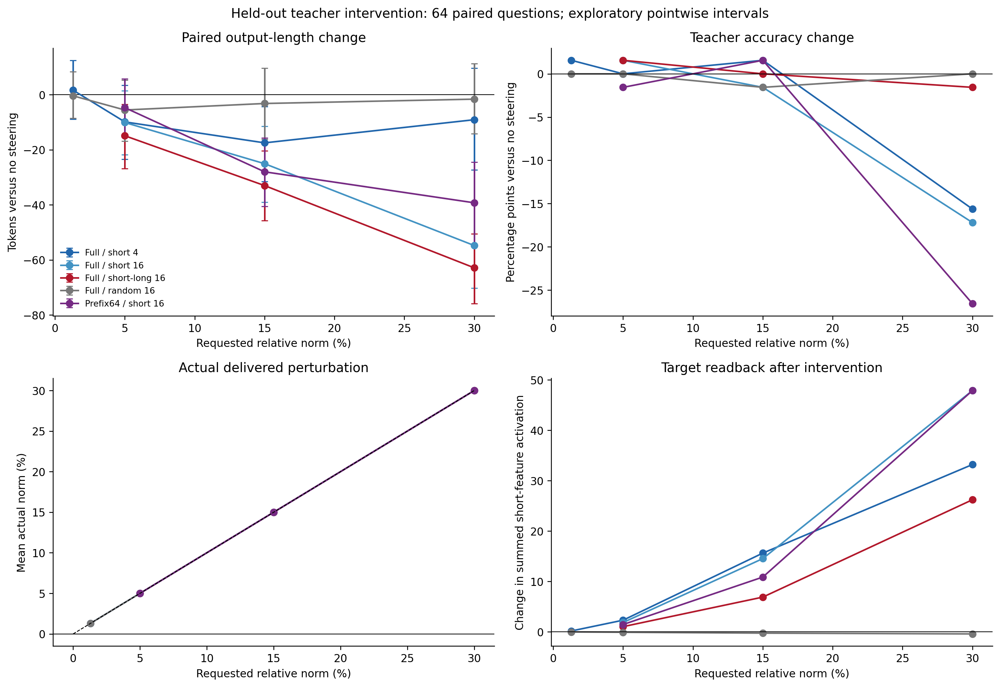
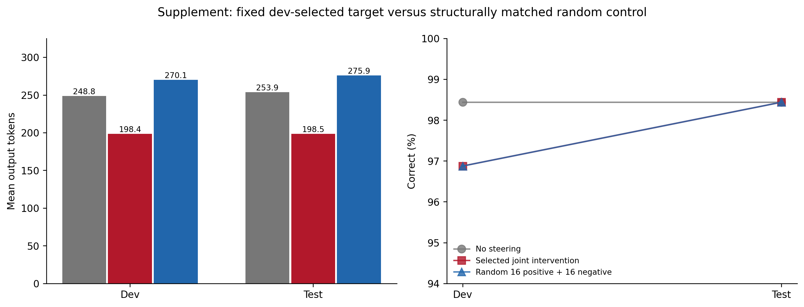
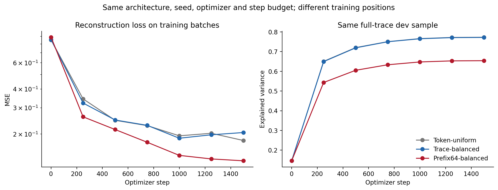
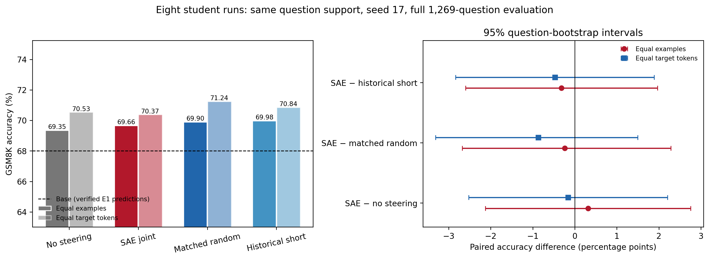
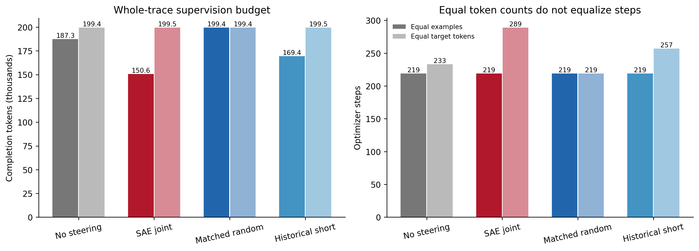
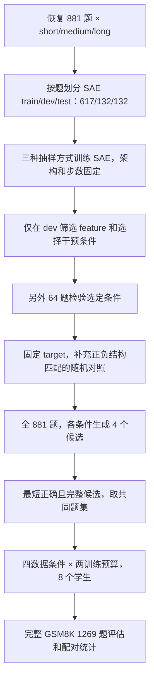
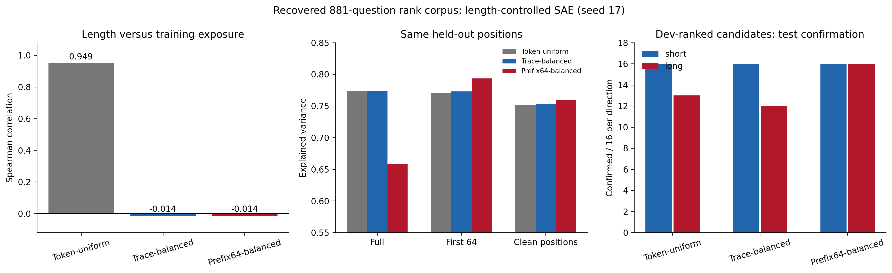

# 当前数据上的长度控制 SAE 与加强干预实验

实验：`phase6_local_length_controlled_strength_v1`。开始日期：2026-09-10。状态：完整实验、逐题评估与最终审计已完成；单种子探索性证据。

**学生结果：** 等样本下，SAE 学生 69.66%，无干预学生 69.35%，差 +0.32 个百分点；等目标 token 下，SAE 学生 70.37%，无干预学生 70.53%，差 -0.16 个百分点。本轮尚未确立同时超越无干预和匹配随机对照的学生收益；教师缩短与学生涨点是两个不同结论。

**复现限制：** 两次相同数据、相同 seed 的随机对照训练出现 1.34 个百分点的分数差；模型权重和早期训练日志已不同。本轮未启用严格确定性训练，因此不能把这些单次执行的细小差值当作稳定收益。

**全量教师取舍：** 联合干预把 881 题四候选的平均输出缩短 20.00%，同时把正确候选率从 98.89% 降至 96.34%；这是有正确率代价的压缩。

**核心结论：** 长度均衡抽样可以去除训练曝光偏差；单纯加强 short 方向可能损伤正确率，而 dev 选定的 short/long 联合干预在本轮留出题上缩短输出约 22%–24%。学生准确率是否改善必须依据下面独立的学生对照，不能由教师缩短推断。

## 已完成的教师实验

完成 3 个 SAE、原定 27 条件 × 64 dev 题与 64 test 题（3,456 条输出），以及结构匹配随机对照的 384 条配对重放。dev 固定选择 `full_trace_balanced__joint16__rho0.3__start0`：使用 full-trace-balanced 字典，增强 16 个 short 方向并减去 16 个 long 方向，从第一个输出 logit 开始注入，实际扰动范数为隐藏状态的 30%。

原定 test 中，平均长度从 **261.61 降至 198.75 tokens（缩短 24.03%）**；准确率从 63/64 变为 62/64。配对长度差为 -62.86 tokens，95% 区间 [-75.89, -50.56]。准确率差的区间为 [-7.81, 3.12] 个百分点，**不能据此证明准确率无损或非劣效**。

图 2：固定字典/方向下的剂量响应、正确率、实际范数及完整 TopK 目标激活读回。区间是点态探索性区间；图中的 random16 对 joint16 仅匹配总范数，没有匹配其总计 32 个方向的正负结构，故另做下面的补充对照。

| 原定 test 对照 | 答对/64 | 平均 tokens | 相对无干预长度差 [95% CI] |
|---|---:|---:|---:|
| 无干预 | 63 | 261.61 | +0.00 [+0.00, +0.00] |
| Full short4 / 1.3% | 64 | 263.23 | +1.62 [-8.89, +12.50] |
| Full short4 / 15% | 64 | 244.12 | -17.48 [-31.55, -4.36] |
| Full short4 / 30% | 53 | 252.53 | -9.08 [-27.31, +9.61] |
| Full short16 / 15% | 62 | 236.56 | -25.05 [-38.98, -11.45] |
| Full short16 / 30% | 52 | 206.84 | -54.77 [-70.22, -39.12] |
| Full joint16 / 15% | 63 | 228.61 | -33.00 [-45.75, -20.34] |
| Full joint16 / 30%（dev 选定） | 62 | 198.75 | -62.86 [-75.89, -50.56] |
| Full long16 / 30% | 64 | 240.41 | -21.20 [-33.80, -8.69] |
| Full random16 / 30% | 63 | 260.00 | -1.61 [-14.22, +11.31] |
| Prefix64 short16 / 15% | 64 | 233.61 | -28.00 [-40.50, -15.70] |
| Prefix64 short16 / 30% | 46 | 222.36 | -39.25 [-54.69, -24.52] |
| Full short4 / 15% / start64 | 64 | 251.72 | -9.89 [-17.64, -2.23] |

**加大力度并非越大越好。** 同样 30% 范数，short16 单独增强只答对 52/64，联合方向答对 62/64；prefix64 short16 则只有 46/64。因此本轮支持的是一个经 dev 选定的具体联合方向，不能推广成‘增强所有 short feature 都有效’。token-uniform SAE 只做训练/重构消融，没有与其字典进行完整干预对照，不能归因说 trace-balanced 训练本身造成了全部干预改善。

**干预确实送达。** 选定条件实际平均范数为 29.9996%；目标 short 激活总和平均从 3.184 变为 29.408，long 从 2.428 变为 0.826。这些是干预前后完整 TopK 编码的读回，包含稀疏支持变化；不说明其他 feature 没有变化，也不为目标赋予单一语义。

### 结构匹配随机对照补充

原分析器用 `count=16` 匹配 joint 与 random；joint 实际包含 16 个正向和 16 个负向特征，原 `random_count_matched=true` 只反映配置参数相同，不能解释为总方向数匹配。发现后保留原协议和输出，固定已经选定的 target，另行冻结补充协议：抽取不重叠于目标的 16 个正向和 16 个负向随机 decoder 方向，各组归一化后相减，再匹配总范数。未重新选择 target，也未按 test 结果更换随机集合。

补充 test 的无干预、目标、随机均答对 63/64；平均长度分别为 253.88、198.45、275.88 tokens。目标比无干预短 **21.83%**，比结构匹配随机短 77.42 tokens（配对区间 [-88.47, -66.81]）。原 test 门槛与补充 dev/test 门槛均通过，因此进入学生阶段。

图 4：每组 64 题，补充重放在 C31 完成。原 test 分片还使用 C32；模型权重、随机数及题目相同，但 BF16 推理不保证跨 GPU 架构逐 token 一致。因此原 test 与补充重放分开报告，不合并成 128 道独立题，也不挑选准确率更高的一次作为唯一结果。每次实验内部同题各条件均在同一卡、同一批次布局运行。

图 3：左图是各自抽样分布上的重构损失，不能直接比较同分布优劣；右图是在相同完整 dev 样本上的 explained variance。

[逐题实例：接近中位数的共同正确例子及首个受损例子](../results/phase6_local_length_controlled_strength_v1/exploratory/analysis/test/paired_examples.md)。选择规则固定且在实例文件中说明，不用例子替代全体统计。“正确”指最终答案验证通过，不代表每一步推导都正确；例如第一个例子的工作收入叙述仍有混乱。受损例子中，干预后把 $4\times6\times3$ 错算为 36，说明缩短仍可能伴随算术错误。

## 已完成的学生蒸馏与完整测分

为 881 道训练题生成每条件 4 个候选，三个生成条件共 **10,572 条输出**。每条件先合并重复文本，再选最短的正确且非截断候选；三组正确题交集为 **873 题**。历史自然 short 使用这一相同题集。4 候选与历史 short 的原 16 候选选择预算不同，历史 short 是一个实际数据基线，不能据此单独估计纯干预效应。纯干预的主要比较是相同四候选预算下的 target 与 no-steering/random。

下面先报告全量生成、尚未按正确性筛选的教师输出。它覆盖 SAE train/dev/test 的全部 881 题，不能作为另一个独立确认集；共同正确题集也会改变难度分布，必须同时报告覆盖率。

| 全量教师数据条件 | 正确候选率 | 平均 tokens | 截断率 | 有正确且完整候选的题数/881 |
|---|---:|---:|---:|---:|
| no_steering | 98.89% | 250.07 | 0.14% | 880 |
| selected_target | 96.34% | 200.06 | 0.00% | 874 |
| matched_random | 98.61% | 267.95 | 0.54% | 881 |

**全量生成的正确率代价已经可见。** 相对无干预，目标的正确候选率差为 -2.55 个百分点，按题重采样、先平均四候选的 95% 区间为 [-3.52, -1.62]。不能把 64 题补充重放中的相同正确率推广成全量无损压缩。后续共同正确题集用于公平 SFT 比较，但不会消除教师生成阶段已经发生的错误。

[全量教师候选统计与按题区间](../results/phase6_local_length_controlled_strength_v1/exploratory/student_followup/teacher_data_summary.json)。

固定 Qwen2.5-1.5B-Instruct 学生、seed 17、LoRA r=4/alpha=16/dropout=0.05、学习率 2e-5、batch 4、梯度累积 1、1 epoch、最大序列 2048、completion-only loss；沿用 E1 验证的 TRL 0.9.6 实现。训练提示词统一使用学生标准提示，不把不同教师指令作为学生条件。8 个 adapter 均完成训练并在 GSM8K `test[50:1319]` 全部 1,269 题上完成 greedy 评估。

图 5：左图是单个训练 seed 的准确率；右图是相同评估题的配对 bootstrap 区间，不估计训练 seed 变异。六个计划对比的 p 值另外做 Holm 校正。图中 base 复用已验证的 E1 同模型字节、同固定题集和同评估实现预测，不计作本次新评估。

| 训练预算 | 数据条件 | 答对/1269 | 准确率 | 学生平均输出 tokens |
|---|---|---:|---:|---:|
| equal_examples | no_steering | 880 | 69.35% | 278.96 |
| equal_examples | selected_target | 884 | 69.66% | 229.78 |
| equal_examples | matched_random | 887 | 69.90% | 301.74 |
| equal_examples | historical_short | 888 | 69.98% | 264.67 |
| equal_target_tokens | no_steering | 895 | 70.53% | 278.58 |
| equal_target_tokens | selected_target | 893 | 70.37% | 228.62 |
| equal_target_tokens | matched_random | 904 | 71.24% | 299.94 |
| equal_target_tokens | historical_short | 899 | 70.84% | 262.93 |

**同数据、同 seed 的执行差异。** matched_random 两组的数据哈希、全部科学设置、219 步预算与初始 LoRA 哈希相同，但分别答对 887 和 904 题（差 1.34 个百分点），有 95 题的正确/错误状态不同。最终 LoRA 参数的相对 L2 差为 0.1493%，早期训练日志已出现差异，所以不能只归因于评估输出文件或把两行差值解释成预算收益。

原配方未请求严格 `full_determinism`。本轮定位了差异在训练执行阶段出现，但没有隔离具体底层算子原因，也没有事后替换任一结果。固定 seed 不等于逐字节可复现；下面按题 bootstrap 的区间不能覆盖这种训练执行变异或跨 seed 变异。产物完整性审计通过也不代表逐字节复现通过。[重复对照审计](../results/phase6_local_length_controlled_strength_v1/exploratory/student_followup/repeated_control_audit.json)。

可复用 base 为 68.01%；历史 E1 全 881 题 short 为 70.84%。后者与本轮共同题集的 historical-short adapter 不是同一训练数据量，不能直接替代本轮同题集比较。

| 预算 | SAE target 相对 | 正确率差（百分点） | 95% 配对 CI | Holm p |
|---|---|---:|---:|---:|
| equal_examples | no_steering | +0.32 | [-2.13, +2.76] | 1.0000 |
| equal_examples | matched_random | -0.24 | [-2.68, +2.29] | 1.0000 |
| equal_examples | historical_short | -0.32 | [-2.60, +1.97] | 1.0000 |
| equal_target_tokens | no_steering | -0.16 | [-2.52, +2.21] | 1.0000 |
| equal_target_tokens | matched_random | -0.87 | [-3.31, +1.50] | 1.0000 |
| equal_target_tokens | historical_short | -0.47 | [-2.84, +1.89] | 1.0000 |

**学生判定：本轮没有确立 SAE 数据学生相对无干预学生的准确率提升；教师输出明显缩短，并不自动转化为学生涨点。表中点估计仍须与配对区间和随机/历史 short 对照一起解释。**

图 6：equal_examples 每题使用一次；equal_target_tokens 复用历史完整轨迹重复算法，重复较短数据以接近四组最大的 completion-token 总量，差距不超过登记的 512 tokens。不裁剪回答。等 token 不等于等优化器步数、等计算或等每题权重，prompt/EOS 开销也未包含在该 token 预算中。最大 token 总量的 matched_random 组无需重复，两种预算的数据文件哈希相同；两次运行不构成独立 seed 复现。

[共同支持与训练预算](../results/phase6_local_length_controlled_strength_v1/exploratory/student_followup/DATA_COMPLETE.json)、[学生逐模型指标与配对统计](../results/phase6_local_length_controlled_strength_v1/exploratory/student_followup/STUDENT_COMPLETE.json)。

## 问题与范围

本轮检验三个问题：控制长轨迹在 SAE 训练中的抽样权重后，重构和长短特征是否改变；增大实际扰动、扩大 feature 集合、提前干预或联合增强/抑制是否能缩短教师回答；如教师效果通过独立于 dev 调参的后续题目检验，是否值得进入学生蒸馏。

这是单个 SAE seed 的探索性实验。使用恢复的原 short/medium/long 各 881 条正确训练轨迹，总计 2,643 条；三份 JSONL 的字节 SHA256 与历史审计一致。它与历史包含 14,096 条原始候选、包括错误轨迹的 SAE 训练池不同。原 Phase 0、B3/B4、Phase 5 的冻结产物和失败门槛均保留。

## 实验流程与数据边界

图中的教师 test 64 题来自 881 道历史训练题的本轮保留部分；学生最后评估的 1,269 题属于另一个固定 GSM8K test split。两者不是同一个集合。标准化后的题目文本完全重叠数为 0，但本项目历史上已观察过这些数据，所以仍保留探索性结论边界。

## 历史结果的正确对应

历史多教师主矩阵的 short 三种子均值为：1.5B 自蒸馏 72.29%、3B 72.03%、7B 70.42%、14B 70.63%。后续 7B 原数据三种子复现的 short 为 70.03%；2026-09-10 本地同数据单种子复查为 70.84%，同环境 base 为 68.01%，净增加 36/1,269 题，即 2.84 个百分点。不能把它们写成同一次实验的不同版本分数，也不能把这些自然 short 数据结果当成 SAE 干预收益。

历史来源：[多教师主矩阵报告](../../small_language_model/docs/short_medium_long/main_matrix_results.md)、[7B 复现实验](phase1_legacy_trace_sae_distillation.md)、[本地完整测分](../results/phase1_local_short_gain_check_v1/analysis/report.md)。目前历史 BeeGFS 底层产物暂不可读；本轮只把可读取的归档报告作为历史引用。本地复查的逐题预测和报告哈希已重新核对。

## 原干预如何实施

旧 Phase 3 在 Qwen2.5-7B 第 18 个 Transformer block（零起始 layer 17）的输出残差上加扰动。SAE 输入经过中心化与一个整体尺度变换，但干预最终加回原始隐藏状态。

短特征增强把 4 个入选 decoder 方向相加并归一化，形成一个向量；旧系数乘以该向量，再除以 SAE 的整体 scale。它没有把 28,672 个 feature 全部增强，也不是每个位置仅在这 4 个 feature 已经激活时才注入。

长特征抑制先完整执行 encoder、TopK=64、ReLU，仅减去当前激活且属于 10 个 long 候选的 decoder 分量。因此有些位置不发生抑制。旧版先生成 64-token 自然前缀，hook 跳过完整 prefill，仅修改后续单 token 前向；这会跳过分支中第一个续写 logit 的干预。

旧校准选定 short 系数 1，平均扰动约为隐藏状态范数的 1.31%；long 系数 0.25，平均约 0.86%，约 55.5% 的记录前向位置被修改。后续 v2 已把 short 系数提高到 12，平均扰动约 14.56%，仍没有条件通过缩短筛选。故“之前一定只是力度不够”不成立，方向、位置、格式混淆与训练数据配方都需要分开检查。

实现来源：[旧控制器](../src/length_budget_distill/sae_intervention.py)、[校准结果](../results/phase3_sae_intervention_distillation_pilot_v1/exploratory/calibration/selected_strengths.json)、[旧加强扫描归档](phase3_sae_intervention_strength_sweep_v2.md)。

## 本轮长度控制

三个 SAE 共用 layer 17、3,584 输入维度、28,672 feature、TopK=64、seed 17、batch 256、1,500 步及原 TopK 训练实现。题目按固定规则划分为 617/132/132，整个题目不会跨 SAE train/dev/test。使用同一个仅由 train token-uniform 样本估计的均值和尺度，避免在采样因素之外再改变标准化。

训练每个 SAE 先建立 250,000 次 token 的有放回抽样池；训练器随后打乱该池，按 batch 256 运行 1,500 步，实际向优化器展示 384,000 个 token 位置。按原训练器的 seed+layer、随机排列和尾批规则精确重放，实际训练曝光与原轨迹长度的 Spearman 相关为 0.9458、−0.0146、−0.0146，与抽样池结论一致。这是本轮明确登记的抽样设计，不冒充历史无放回抽样的逐字节复现。[实际训练曝光审计](../results/phase6_local_length_controlled_strength_v1/exploratory/training_exposure_audit.json)。

- `full_token_uniform`：所有训练 token 等概率，长轨迹获得更多抽样次数。
- `full_trace_balanced`：各条轨迹等权，再在轨迹内部抽位置。
- `prefix64_trace_balanced`：各条轨迹等权，仅抽其前 64 个 token。

Explained variance（解释方差）在这里是重构指标：$1-\sum_t\|x_t-\hat{x}_t\|^2/\sum_t\|x_t-\bar{x}\|^2$，衡量相对只预测均值，SAE 消除了多少平方重构误差。0.774 表示约 77.4% 的该方差被重构解释；它不是 feature 的语义正确率，也不是模型答题准确率。

标签不进入 SAE 重构损失，也没有增加显式长度惩罚。三个模型使用相同的完整 dev/test 抽样用于训练监控；最终另外在所有相同测试轨迹的 full、first64、清理后位置上比较重构。

图 1：横向第一组统计基于 250,000 次抽样池，而非 384,000 次优化器展示；token-uniform 的长度—抽样量相关为 0.949，两个 trace-balanced 条件均为 −0.014。完整测试轨迹的 explained variance 分别为 0.7741、0.7738、0.6582；共同 first64 位置分别为 0.7710、0.7727、0.7935。右图只统计本次每方向 dev 排名前 16 个候选中的 test 确认数，不是所有 feature 的确认总数，也没有跨字典对齐编号。图中的 clean positions 重构包含各轨迹最多 64 个合格位置；后续配对 feature 筛选则严格要求同题短/长各有完整 64 个合格位置。

## 本轮 feature 选择与干预

先排除 `Answer:` 答案段、末尾 32 个 token 和格式 token；在前 128 个原始位置内，每条短/长轨迹各保留恰好 64 个合格位置。只在同题两条轨迹均满足支持条件时做配对比较。这样固定了激活均值的分母，也减少答案标记导致的混淆；它不能保证剩余差异具有单一语义。

Feature 只由 dev 的配对效应排序，选前 4 或前 16 个方向；统计门槛和 test 复现结果另外报告。探索性候选可以进入本次干预，但不会把未通过统计门槛的候选称为已确认特征。不同 checkpoint 的编号独立，不能直接搬用历史 F26100、F24086 等编号。

本轮 full-trace-balanced 字典的前四个 short 候选为 19235、24086、16074、4552，前四个 long 候选为 18351、8915、27496、5678。prefix64 字典的前四个 short 候选为 11826、26379、9225、5048。即使某个编号与历史字典巧合相同，也以本轮 checkpoint 哈希及本轮筛选为准。[完整 full 字典筛选](../results/phase6_local_length_controlled_strength_v1/exploratory/feature_screen/full_trace_balanced/SCREEN_COMPLETE.json)、[完整 prefix64 筛选](../results/phase6_local_length_controlled_strength_v1/exploratory/feature_screen/prefix64_trace_balanced/SCREEN_COMPLETE.json)。

新的干预直接指定实际相对范数：

\[
h'_t=h_t+\rho\|h_t\|_2\frac{v_t}{\|v_t\|_2},
\qquad \rho\in\{0.013,0.05,0.15,0.30\}.
\]

其中 $v_t$ 可以是短方向的和、短方向减长方向、随机 decoder 方向的和，或负的当前活跃 long 分量。long 候选均未激活时，扰动为零。增加 feature 数时仍归一化总方向，因此不会把“更多 feature”和“总扰动更大”混在一起。30% 是明确增加的探索性强干预，不预设它会提高正确率。

对照包括前 4 与前 16 个 feature、完整与 prefix64 字典、short 增强与联合 long 抑制、从首个输出 logit 开始与 64-token 后开始，以及同字典/同实际范数的随机方向。每条回答只统计尚未结束的有效位置，包含预测 EOS 的位置；不会把其他回答结束后的 padding 前向计入干预覆盖率。

这里直接改变隐藏状态 $h$，没有把稀疏编码 $z$ 的若干坐标强行设成预定值；重新编码后，其他 feature 和 TopK 支持也可能改变。联合方向是静态的 short 方向减 long 方向，与单独 long 条件中仅减去当前已激活分量的实现不同。

每个条件从独立 KV cache 开始；同题使用完全相同的逐位置随机数，64-token 后干预条件另核对其前缀确实与无干预一致。回读干预前后完整 TopK 编码，报告目标短/长 feature 的变化，避免只报告外部系数。

从第一个输出 logit 开始的条件，会修改提示词最后一个位置的隐藏状态；此位置不是 SAE 训练的 completion token，后续位置才进入 completion 分布。与 start64 的对照能检验提前干预的行为差异，但不能单独区分提示末端注入与早期 reasoning 注入的贡献。与旧 v2 比较时，数据池、字典、feature 集合及随机采样实现均改变；本轮内部的固定方向剂量对照才能用于判断增加实际范数的影响。

## 结果与完成条件

教师阶段：64 道 dev 题与另外 64 道 test 题，每条件每题一个候选，四卡不相交题目分片，最大 512 token。dev 和 test 都属于已观察过的历史 GSM8K 训练题池；后者只是本轮不用于选择超参数的题目，不是新的 untouched confirmation。

正确率由最终答案提取与 gold 答案比较得到，不逐步验证整段推导；“正确候选”也不保证中间推理完全正确。

报告准确率、全部输出长度、共同正确题的长度、截断率、相对无干预及同范数随机方向的配对区间、实际扰动和目标读回。dev 按预登记规则选一个候选，后续 test 检查需达到至少 5% 缩短、配对长度区间低于零、正确率点估计下降不超过 5 个百分点，并优于匹配随机方向。正确率点估计门槛不等于已证明非劣效。

本轮教师门槛通过，已经完成登记的四候选、881 题、单 seed=17 学生后续：自然无干预、目标干预、匹配随机方向、原自然 short，所有方法取正确共同题集，分别进行等样本与等监督 token 训练，复用已在 E1 验证的 legacy TRL 配方，完整评估 GSM8K `test[50:1319]`。若门槛失败，报告阴性结果并明确学生阶段未触发，不把旧 pilot 的学生结果算作本次结果。

本轮最终报告需有全部分片、无重复/缺失审计、输入/配置/源码/模型哈希、逐题预测、配对统计和完成标记。本轮已达到上述完整性要求，见最终审计与完成标记。

可直接用于介绍表示方式的一页英文 PPT 文字：[Sparse Autoencoders: A Larger Dictionary, Sparse Activation](sae_representation_one_slide_en.md)。

## 可复查入口

- [实验配置](../configs/phase6_local_length_controlled_strength_v1.json)
- [数据恢复证据](../results/phase6_local_length_controlled_strength_v1/exploratory/RECOVERY_COMPLETE.json)
- [训练启动记录](../results/phase6_local_length_controlled_strength_v1/exploratory/sae_launch.json)
- [数据与状态提取](../src/length_budget_distill/sae_local_data.py)
- [复用 SAE 训练入口](../scripts/2_4_train_topk_sae.py)
- [共同支持评分](../src/length_budget_distill/sae_local_screen.py)
- [实测范数干预与独立缓存生成](../src/length_budget_distill/sae_norm_intervention.py)
- [干预行为测试](../tests/test_sae_norm_intervention.py)
- [结构匹配随机对照](../src/length_budget_distill/sae_joint_control.py)
- [学生数据、训练与评估入口](../scripts/6_7_run_local_intervention_students.py)
- [复用的学生训练实现](../src/length_budget_distill/legacy_replication.py)
- [学生后续的顺序执行脚本](../scripts/slurm/6_8_complete_local_sae_followup.sh)
- [报告生成与完整审计](../scripts/6_5_finalize_local_sae_strength.py)

## 完整产物与审计

[Dev 全条件与选定依据](../results/phase6_local_length_controlled_strength_v1/exploratory/analysis/dev/teacher_report.md)、[Test 全 27 条件](../results/phase6_local_length_controlled_strength_v1/exploratory/analysis/test/teacher_report.md)、[结构匹配补充](../results/phase6_local_length_controlled_strength_v1/exploratory/matched_joint_control/analysis.json)、[补充协议](../configs/phase6_local_matched_joint_control_v1.json)、[原教师决策](../results/phase6_local_length_controlled_strength_v1/exploratory/TEACHER_DECISION.json)、[补充教师决策](../results/phase6_local_length_controlled_strength_v1/exploratory/MATCHED_CONTROL_DECISION.json)、[最终审计](../results/phase6_local_length_controlled_strength_v1/exploratory/FINAL_AUDIT.json)、[完成标记](../results/phase6_local_length_controlled_strength_v1/exploratory/EXPERIMENT_COMPLETE.json)。

原教师决策文件是在门槛判断时冻结的，里面 `student_triggered=false` 表示当时尚未启动；后续是否完成以 `student_followup/STUDENT_COMPLETE.json` 与总完成标记为准，不改写已被后续协议哈希绑定的旧状态。

完成标记仅证明本轮登记的探索性工作完成，不等于正式论文结论。主要限制包括已观察的单一 GSM8K 数据、仅有正确 rank 轨迹、一个 SAE/学生 seed、一个随机方向集合、教师门槛的正确率点估计规则，以及 equal-token 重复造成的步数和题目权重差异。未做独立 OOD 或训练 seed 复现。

展示复核：图 5 的图例增加留白；此展示版本对应原实验完成标记。参见[展示复核记录](../results/phase6_local_length_controlled_strength_v1/exploratory/PRESENTATION_REVIEW_COMPLETE.json)。
