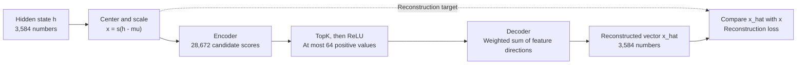
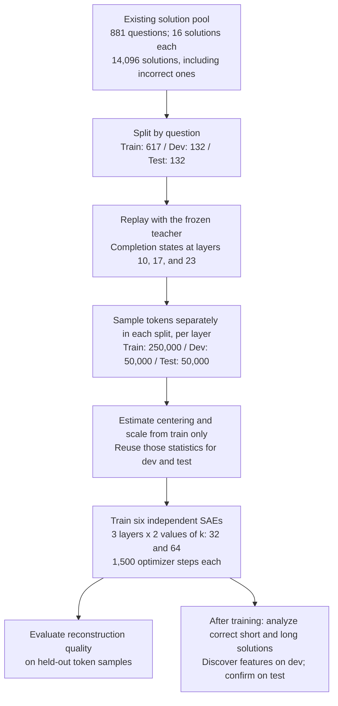

# How SAE Training Works and How Features Map to Tokens: An Illustrated Tutorial

[Chinese version](sae_training_and_feature_to_token_zh.md) · [Tutorial index](README.md)

This tutorial follows the implementation, recorded experiments, and seven feature-analysis figures in `SAE_long_short`. It explains the path from text to hidden states, from hidden states to sparse autoencoder (SAE) features, and from feature activations back to the tokens shown in a visualization. It assumes familiarity with a language model generating text one token at a time, but no prior experience training an SAE.

**An SAE represents a hidden state using a small number of learned feature directions. Its decoder reconstructs a hidden vector. The words in the feature plots come from recorded token positions; vocabulary scores come from the language model's output layer.**

This English edition was prepared on 2026-09-10 from the Chinese tutorial dated 2026-09-05, with an expanded explanation of reconstruction. It describes the original Phase 2 exploratory analysis. Its numbers do not report later intervention or student-training results. The corresponding protocols set `formal_claim_allowed=false`, including for historical artifacts stored under `formal/`. Some original training files are unavailable in this checkout; Section 9 distinguishes retained evidence from historical values that could not be checked again.

Read Sections 1–3 for training, Section 4 for feature-to-token alignment, and Sections 5–7 for interpreting the experimental figures. Use a Markdown viewer with math and Mermaid support. The two explanatory diagrams are written directly in English, while the seven existing analysis plots are reused with English captions. The original training-curve image remains linked with its Chinese labels identified.

## 1. What goes into the SAE?

SAE stands for **Sparse Autoencoder**. An autoencoder takes a vector as input and learns to reconstruct that same vector. Sparsity means that only a small number of entries in its intermediate representation may be nonzero.

In this project, existing mathematical solutions are passed through a frozen Qwen2.5-7B-Instruct model to collect its internal states. This is called *replay* or *teacher forcing*: the solution already exists, and the model reads it to produce hidden states. Because attention is causal, the state at solution position $t$ depends on the prompt and the solution text up to and including that position.

```text
Question + existing solution
        | tokenizer: convert text to token IDs
        v
Frozen Qwen2.5-7B-Instruct
        | read the output of a selected Transformer block
        v
Hidden state h_t at solution position t: shape [3584]
        | center and scale using training-set statistics
        v
SAE: encode -> sparsify -> reconstruct the normalized hidden state
```

The extracted vector is the **post-block residual**: the residual-stream state after a Transformer block has finished its computation. The selected layer indices are 10, 17, and 23, using zero-based indexing. Thus, layer 17 is the eighteenth block. Each vector contains 3,584 numbers.

A solution of length $T$ supplies a $T\times3584$ matrix at one layer. Each sampled token position supplies one SAE training example. **The same token string can have different hidden states and feature activations in different contexts.**

Only completion-token states, meaning the solution portion, are stored for this pilot. The question participates in the model's forward pass, but question positions are not SAE training examples here. The activation files also record `token_ids`, `trace_indices`, and `positions`, which allow later analysis to retrieve the original text.

Code: [activation-extraction entrypoint](../../scripts/2_2_extract_residual_activations.py) and [activation storage and text replay](../../src/length_budget_distill/sae_activations.py).

## 2. What exactly is a feature?



**Figure 1. The SAE computation.** The encoder chooses a sparse combination of learned directions; the decoder combines them to approximate the normalized input. This is a schematic of the computation, with no measured feature activations or proposed semantic labels.

Think of the SAE as learning a dictionary of vector building blocks. The dictionary contains many directions, but each input uses only a few, with different coefficients, to reconstruct its hidden state.

For feature $j$, distinguish three objects:

- **Feature ID $j$:** its index in the dictionary, such as `F11983`. The number itself carries no semantic meaning.
- **Activation $z_{t,j}$:** the nonnegative strength of this feature at the current token position. It varies across positions and contexts.
- **Decoder direction $d_j\in\mathbb{R}^{3584}$:** the learned vector that this feature contributes to reconstruction. It is fixed once the checkpoint is fixed.

The corresponding encoder weights and bias compute a candidate score. Whether the feature ultimately activates also depends on the scores of other features through TopK selection.

This project encodes a 3,584-dimensional input into a **28,672-dimensional feature space**, an expansion factor of eight. The primary SAE uses $k=64$: at most 64 feature activations are positive at each position, and the rest are zero. The larger dictionary supplies more candidate directions; sparsity limits how many can participate in each reconstruction.

Here is a **fictional small example**:

```text
Encoder scores at one position: [3.0, -0.5, 1.2, 4.0, 0.2]
With k = 2: select the two highest scores, then apply ReLU
Sparse representation z:        [3.0,  0.0, 0.0, 4.0, 0.0]
Reconstructed vector x_hat:     b_dec + 3.0 * d_0 + 4.0 * d_3
```

Here, `d_0` and `d_3` are vectors. Their weighted sum, together with the decoder bias, produces the reconstructed vector. Section 3.5 works through this addition numerically. One token can activate several features, and one feature can activate at many tokens and in many contexts.

**Feature IDs are meaningful only within a particular checkpoint.** Changing the layer, $k$, or training run can change the dictionary. Equal IDs across two dictionaries do not establish that they represent the same feature. Counts can be aggregated across the six SAEs, but their feature identities have not been automatically aligned.

## 3. How is the SAE trained?

### 3.1 Prepare the data: split questions before sampling tokens



**Figure 2. Training and subsequent feature analysis.** All solutions from a question stay in the same split. SAE optimization uses hidden states from mixed solution lengths and correctness outcomes. Short/long comparisons are performed after dictionary training.

The pool contains 881 GSM8K questions, with 16 existing solutions per question, for 14,096 solutions in total. The split contains 617 training questions, 132 development questions, and 132 test questions. Keeping all solutions to a question in the same split prevents leakage from that question across splits.

Within each split, token positions are sampled deterministically without replacement from the full solutions. **Each layer** supplies 250,000 training vectors and 50,000 vectors each for development and test. The $k=32$ and $k=64$ SAEs at a given layer use the same sampled artifacts. Incorrect solutions participate in dictionary training, and short/long labels do not enter the SAE loss.

This original sampling scheme operates over tokens. Longer solutions provide more eligible token positions and therefore contribute more samples in expectation. Ignoring length labels during optimization does not give each short and long solution equal training weight. This tutorial describes the original dictionaries; later sampling ablations have separate protocols and results.

### 3.2 Normalize the hidden states

Estimate a mean vector $\mu$ and a scalar scale factor $s$ using training samples only:

$$
x_t=s(h_t-\mu),\qquad
s=\sqrt{\frac{3584}{\mathbb{E}_{\mathrm{train}}\|h_t-\mu\|_2^2}}.
$$

First subtract the average training state, then adjust the overall numerical scale. A single scalar rescales every coordinate; there is no separate division by each coordinate's standard deviation. Development and test samples reuse the training estimates of $\mu$ and $s$.

### 3.3 Encoder: turn a hidden state into candidate scores

$$
a_t=W_{\mathrm{enc}}(x_t-b_{\mathrm{dec}})+b_{\mathrm{enc}}.
$$

$W_{\mathrm{enc}}$ has shape $28672\times3584$, so $a_t$ contains 28,672 scores. The decoder bias $b_{\mathrm{dec}}$ is a trainable parameter, distinct from the data-estimated mean $\mu$ used for normalization.

The encoder computes one candidate score per feature. These scores are not passed through softmax and need not sum to one. Their role is to determine which features activate and with what strength.

### 3.4 TopK: allow only a few features to contribute

Let $I_t$ contain the indices of the $k$ largest entries of $a_t$:

$$
z_{t,j}=\begin{cases}
\max(a_{t,j},0),&j\in I_t,\\
0,&j\notin I_t.
\end{cases}
$$

The code calls `torch.topk(pre, k)` first and applies `ReLU` to the selected values. Consequently, there are **at most** $k$ positive activations: a selected nonpositive score becomes zero. The historical primary SAE evaluation reported a mean of 64 nonzero activations per test token.

TopK imposes sparsity structurally. The project does not add an L1 activation penalty. For background on controlling SAE sparsity with $k$, the original tutorial cites [Gao et al., Scaling and Evaluating Sparse Autoencoders](https://arxiv.org/abs/2406.04093). The equations and settings here follow the local implementation.

### 3.5 Decoder: what does a reconstructed vector mean?

**The reconstructed vector is the SAE's approximation to its input, assembled from the active feature directions.** It has the same dimensionality and coordinate system as the normalized input $x_t$:

$$
\hat x_t=b_{\mathrm{dec}}+\sum_{j\in I_t}z_{t,j}d_j.
$$

The hat in $\hat x_t$ denotes an approximation. The input $x_t$ and reconstruction $\hat x_t$ each contain 3,584 numbers. Between them, the sparse representation $z_t$ contains 28,672 feature coefficients, with at most 64 positive values in the primary SAE.

To make the vector addition concrete, consider a **fictional two-dimensional example**:

$$
d_0=(1,0),\qquad d_3=(0,1),\qquad b_{\mathrm{dec}}=(0,0).
$$

Using the activations $z_0=3$ and $z_3=4$ from Section 2 gives

$$
\hat x=3(1,0)+4(0,1)=(3,4).
$$

If the input is $x=(3.1,3.9)$, the reconstruction approximates it with $(3,4)$. The residual error is $x-\hat x=(0.1,-0.1)$, and the mean squared error over the two coordinates is $0.01$. Training adjusts the encoder and decoder parameters to reduce this error while retaining the sparsity constraint. The simple orthogonal directions in this example are chosen for arithmetic clarity; learned directions need not be orthogonal.

The implementation stores all $d_j$ as rows of `decoder_weight`, with shape `[28672, 3584]`. For a batch, the equivalent dense expression is:

```python
x_hat = z @ decoder_weight + decoder_bias
```

The actual implementation retrieves only the selected directions and sums their weighted contributions, avoiding a dense expansion of the sparse representation.

Encoder and decoder weights start with equal values but train independently afterward. Every decoder direction is maintained at unit norm. A direction $d_j$ is one building block; the reconstruction $\hat x_t$ is the combined result.

To express the reconstruction in the original language-model coordinates, undo normalization:

$$
\hat h_t=\frac{\hat x_t}{s}+\mu.
$$

This recovers an approximation to the internal state at one token position. Converting feature activations into visible token labels requires the separate alignment procedure in Section 4.

### 3.6 Loss and backpropagation: optimize the SAE parameters

The main objective is reconstruction mean squared error:

$$
\mathcal L_{\mathrm{recon}}
=\frac{1}{B\cdot3584}\sum_{t=1}^{B}\|x_t-\hat x_t\|_2^2.
$$

Here $B$ is the number of sampled token states in the batch; $t$ indexes those samples in this equation. The input is a normalized hidden state, and the target is that same state. The teacher has already supplied cached activations. Optimization updates only the SAE encoder, decoder, and biases. The loss contains neither next-token cross-entropy nor a short/long classification objective.

Features that remain inactive receive little opportunity to learn through the main reconstruction path. The project adds a **dead-feature auxiliary loss**. Among features that have not activated for 200 consecutive training steps, it selects at most 256 per sample to reconstruct the remaining error $r=x-\hat x$. The target residual is detached from the gradient computation, and the auxiliary error is normalized by its mean squared magnitude:

$$
\mathcal L_{\mathrm{aux}}
=\frac{\operatorname{mean}[(\hat r_{\mathrm{dead}}-\operatorname{stopgrad}(r))^2]}
{\max(\operatorname{mean}[\operatorname{stopgrad}(r)^2],10^{-8})},
\qquad
\mathcal L=\mathcal L_{\mathrm{recon}}+0.03125\mathcal L_{\mathrm{aux}}.
$$

The auxiliary loss is zero when there are no eligible dead features. This mechanism gives inactive directions an opportunity to learn; it does not guarantee that every feature acquires an interpretable meaning.

One optimization step follows this sequence:

```text
Sample 256 cached hidden states -> normalize
    -> encoder scores -> TopK + ReLU
    -> decoder reconstruction -> reconstruction loss + auxiliary loss
    -> backpropagate into the SAE parameters
    -> remove each decoder gradient's component along its own direction
    -> clip gradients -> AdamW update -> normalize decoder directions
```

Each SAE is configured for 1,500 steps, a peak learning rate of `3e-4`, 100 warmup steps followed by cosine decay, batch size 256, seed 17, zero weight decay, and a gradient-clipping norm of one. Parameters are FP32, with BF16 autocast for the main forward computations. Development evaluation runs every 100 steps and checkpoints are saved every 500 steps. The original analysis uses the final step-1,500 models.

Three layers and two values of $k$ give six independent SAEs. Short and long solutions are compared using the same dictionary within each layer/$k$ condition.

### 3.7 What do the training metrics tell us?

The Chinese tutorial records the following historical values for the primary SAE, layer 17 with $k=64$:

- Training-batch reconstruction MSE decreased from approximately **0.843** at step 1 to **0.193** at step 1,500. The final total loss was approximately **0.224**, including the auxiliary term.
- Final test MSE was **0.2232**, with explained variance **0.7766**.
- The test mean was **64** nonzero features per token. Approximately **0.122%** of dictionary features never activated in that test sample.

The original JSON training log and six-SAE metrics CSV are currently unavailable, so these values are retained as historical reports from the [Chinese tutorial](sae_training_and_feature_to_token_zh.md), rather than as a newly verified training evaluation. The saved [training-curve figure, with Chinese labels](../../figures/phase2_sae_explainer_v2/02_sae_training_and_identification_zh.png), remains readable: its lower-left red curve is training-batch reconstruction loss, its blue curve is development explained variance, and its lower-right panel compares test reconstruction across six SAEs. The red curve excludes the auxiliary loss.

The implementation computes explained variance as

$$
\mathrm{EV}=1-\frac{\sum_t\|x_t-\hat x_t\|_2^2}
{\sum_t\|x_t-\bar x_{\mathrm{eval}}\|_2^2}.
$$

Here $\bar x_{\mathrm{eval}}$ is the mean input vector in the evaluated sample. An EV near 0.777 means that reconstruction accounts for approximately 77.7% of hidden-state variation under this metric. It does not measure mathematical answer accuracy. Likewise, the fraction of features inactive over the entire test sample differs from the 200-step definition of dead features during training.

Reconstruction quality measures how well the representation preserves its input. Interpretable feature meaning and effects on generated text require separate evidence.

## 4. How do features map to tokens?

### 4.1 In these plots: retrieve the token where an activation occurred

A label such as `F11983: Answer` is produced through the following alignment:

```text
Original token ID at a solution position --------------------+
        |                                                   |
        v                                                   |
Teacher hidden state h_t at that position                    |
        | normalize, then run the SAE encoder               |
        v                                                   |
Feature ID j and activation z_tj                            |
        | align by trace_id + position                      |
        +---------------------------------------------------+
                                                            |
                                                            v
Event: (feature_id, activation, token_id, position, trace_id)
        | tokenizer renders the recorded token_id
        v
Token heatmaps, top-token summaries, and context windows
```

The operation is **position alignment followed by vocabulary lookup**. The tokenizer interprets a `token_id`. Passing a `feature_id` to a tokenizer would simply retrieve an unrelated vocabulary entry with the same numerical index, if that index exists.

This is a real event from the primary SAE's test event file, with the fields needed to locate it:

```json
{
  "trace_id": "hf-000026:qwen2p5_7b:unconstrained_sample_pool:candidate_02",
  "analysis_length_label": "long",
  "feature_id": 11983,
  "position": 301,
  "token_id": 16141,
  "activation": 5.75
}
```

`position=301` refers to the 302nd completion token because positions are zero-based. The retained token summaries identify vocabulary ID `16141` as `Answer` for the project tokenizer. The observation is therefore: **F11983 has activation 5.75 at the position where this long solution contains `Answer`.**

This feature is associated with short solutions, yet it also activates in a long solution. A short association describes a difference between groups; it does not restrict activation to short solutions.

Sources: [selected_feature_token_events.jsonl](../../results/phase2_short_long_feature_analysis_v1/exploratory/feature_scores/layer_17_k_064/selected_feature_token_events.jsonl) and [token_contexts.md](../../results/phase2_short_long_feature_analysis_v1/exploratory/analysis/token_contexts.md).

### 4.2 What does one cell in a token heatmap represent?

[](../../figures/phase2_short_long_feature_analysis_v1/04_same_question_token_heatmap.png)

**Figure 3. Real example: question `hf-000649`.** The top solution has 224 tokens in total; the bottom solution has 407. Each panel displays only its first 64 tokens. Columns are original tokens, rows are selected features, and color represents nonnegative activation $z_{t,j}$. The `S`/`L` prefix indicates the association discovered on dev. Confirmation status must be checked in Figure 5 or the result CSV.

To read a bright cell, find its feature row and token column: the feature is strongly active at that context position. Black typically means that this feature's activation is zero there. Other features and the teacher's hidden state can still be nonzero.

Column $t$ in each panel refers to that solution's own $t$th token. Columns are not semantically aligned words or matched reasoning steps. The nearly dark short-associated rows in the first 64 tokens are consistent with the observation that these features often activate near the end of solutions. This single example is not a statistical test of that pattern.

Markers such as `▁` make spaces visible, while `\n` denotes a newline. A token may be a word, a subword, a number, punctuation, or several formatting characters.

### 4.3 Two different meanings of “top token”

**Conditional mean activation** asks: when a particular token occurs, how strongly does this feature activate on average?

$$
\mathrm{conditional\_mean}_j(v)
=\frac{\sum_{t:\mathrm{token}_t=v}z_{t,j}}
{\#\{t:\mathrm{token}_t=v\}}.
$$

The denominator includes occurrences where the feature is inactive. Original plot `05` computes this separately for the specified short/long group and requires at least eight occurrences of a token.

**Share of total activation** asks: what fraction of this feature's activation mass comes from a particular token?

$$
\mathrm{mass\_share}_j(v)
=\frac{\sum_{t:\mathrm{token}_t=v}z_{t,j}}
{\sum_t z_{t,j}}.
$$

Original plot `07` uses this quantity after pooling short and long test events. A frequent token can contribute a large share of total activation even if its activation on each occurrence is moderate. Consequently, the two plots can have different top tokens without disagreeing. An activation-mass share is not the probability of generating that token.

### 4.4 How could a feature affect generation?

An intervention must modify a hidden state and pass through the remaining language-model computation. The following equation illustrates an additive intervention along one feature direction; it does not report an intervention effect established by this tutorial:

$$
h'_t=h_t+\frac{\Delta z_j}{s}d_j.
$$

The decoder direction lives in the normalized coordinate system, so its contribution must be divided by $s$ to return to the original hidden-state scale. This update preserves the component of the original state that the SAE failed to reconstruct. Replacing the entire state with $\hat h_t=\hat x_t/s+\mu$ would also introduce the SAE's reconstruction error.

Here $\Delta z_j$ specifies the coefficient of an added direction. Since dictionary directions need not be orthogonal, re-encoding the modified state need not change only feature $j$ by exactly that amount.

```text
Choose an additive change along a feature direction
        | convert the direction to the original hidden-state scale
        v
Modify a layer's residual state h_t
        | remaining Transformer blocks
        v
Final normalization -> LM head -> logits for the full vocabulary
        | token selection under the decoding policy
        v
Next token ID -> tokenizer renders text
```

Softmax can convert logits to probabilities for sampling; greedy decoding chooses the highest-scoring token. The vocabulary scores depend on the subsequent network computation.

Timing also matters. Observing strong F11983 activation at an `Answer` token describes the state **after the model has read that token**. The output at that position is ordinarily used to predict the next token. This observation alone does not establish that F11983 caused the current `Answer` token to be generated.

Projecting a middle-layer decoder direction directly onto the LM head can provide an approximate diagnostic, but it cannot replace the actual forward pass or an intervention evaluation. The token labels in this tutorial come from the alignment in Section 4.1.

## 5. How are short- and long-associated features identified?

Length labels are used for this analysis after the SAE has been trained. Among correct solutions to each question, approximately the shortest 20% are labeled short and the longest 20% long, with each tail count rounded up. Incorrect solutions contribute to the preceding dictionary training but are excluded from these paired comparisons of correct short and long solutions.

First compute the mean activation of feature $j$ for each solution trace $r$:

$$
A_{r,j}=\frac{1}{T_r}\sum_{t=1}^{T_r}z_{r,t,j}.
$$

Then average the short traces and long traces within each question $q$, and subtract:

$$
\Delta_{q,j}
=\operatorname{mean}_{r\in\mathrm{short}(q)}A_{r,j}
-\operatorname{mean}_{r\in\mathrm{long}(q)}A_{r,j}.
$$

Finally, calculate a standardized paired effect across questions:

$$
d^{\mathrm{paired}}_j
=\frac{\operatorname{mean}_q\Delta_{q,j}}
{\operatorname{sd}_q\Delta_{q,j}}.
$$

The implementation uses the sample standard deviation. A positive effect indicates greater mean activation in short solutions; a negative effect indicates greater mean activation in long solutions. **The question is the unit of statistical inference.** Thousands of correlated token positions are not treated as independent observations.

The figures abbreviate the paired effect as $d$. We write $d^{\mathrm{paired}}_j$ here to distinguish this scalar statistic from the decoder direction vector $d_j$ in Sections 2–4.

**Discovery uses dev questions; confirmation uses test questions.** Dev selection prioritizes features with trace prevalence of at least 5%, a Benjamini–Hochberg (BH) adjusted $q\le0.05$, an absolute primary paired effect of at least 0.2, and matching effect directions for the full solution and its first 64 tokens. Up to 12 candidates per direction are selected. The implementation can fill remaining places with candidates that fail some discovery criteria, so candidate files also expose `passes_discovery_gate`.

On test, Holm correction is applied to the candidates' primary-metric tests. Confirmation requires an adjusted $p\le0.05$, an absolute primary paired effect of at least 0.15, and replication of the expected sign for both the full-solution and first-64-token effects. The first-64 condition requires **sign agreement**, with no separate significance threshold. Passing this rule does not establish that positional or lexical explanations have been eliminated. These are the original Phase 2 rules; later screening variants must be read under their own protocols.

[](../../figures/phase2_short_long_feature_analysis_v1/02_primary_sae_discovery_volcano.png)

**Figure 4. Read effect direction, then statistical evidence.** The horizontal axis is the short-minus-long paired effect: right indicates a short association, and left indicates a long association. The vertical axis is the negative logarithm of the BH-adjusted $q$ value. Height reflects statistical evidence on dev, rather than activation strength. A small $q$ value does not establish an interpretable semantic role.

[](../../figures/phase2_short_long_feature_analysis_v1/03_heldout_feature_validation.png)

**Figure 5. Does the effect replicate on questions excluded from discovery?** Each row is a feature. Columns show paired effects for different splits or aggregation metrics, rather than raw token activations. Blue indicates greater activation in short solutions; red indicates greater activation in long solutions. `mean` includes zeros at inactive positions, `frequency` is the fraction of positions with positive activation, and `maximum` is the largest activation in a trace.

For example, F493 has a test full-solution effect of approximately 2.87 but a first-64 effect of approximately −0.02. Its early sign reverses, so it is not confirmed. F11983 has a test full-solution effect of approximately 2.275 and a first-64 effect of approximately 0.059. The latter meets the sign requirement while remaining small.

Sources: [analysis protocol](../../configs/phase2_short_long_feature_analysis_v1.json) and [primary held-out feature results](../../results/phase2_short_long_feature_analysis_v1/exploratory/analysis/primary_heldout_features.csv).

## 6. A real example: why is F11983 labeled “Answer”?

[](../../figures/phase2_short_long_feature_analysis_v1/07_confirmed_feature_token_anatomy.png)

**Figure 6. Connecting features to token occurrences.** Panel A shows where activation occurs within solutions. Panel B shows how much activation mass is concentrated on one token. Panel C compares paired effects over the full solution and its first 64 tokens.

For F11983 in the layer-17, $k=64$ SAE, the retained test-event summary reports:

- The token contributing the most activation mass is `Answer`, vocabulary ID **16141**.
- **96.35%** of its activation mass occurs at this token.
- The short-minus-long paired effect of mean activation is approximately **2.275** over the full solution and **0.059** over the first 64 tokens.

A supported description is: “In these solutions, F11983 is strongly associated with the `Answer` token and the ending region, and its activation averaged over all tokens is higher in the short group.” Naming it a “concise reasoning ability” or a “response-length switch” would require additional evidence.

How can it be short-associated even when both groups contain `Answer`? Consider a **purely illustrative example**. Suppose a short and a long solution each activate the feature once at `Answer`, with activation six. If the solutions contain 100 and 300 tokens, respectively, their mean activations are $6/100=0.06$ and $6/300=0.02$. Averaging the same terminal activation over different lengths creates a short-minus-long difference.

This example demonstrates a possible mechanism; it does not establish that it explains the entire observed effect. The ending concentration in panel A, lexical concentration in panel B, and small early effect in panel C motivate explicit tests of answer formatting and length normalization.

Other real examples illustrate the many-to-many relationship between features and tokens. Approximately **96.99%** of F7541's activation mass comes from `Answer`. For F5834, the top token is `]` followed by two newlines, accounting for approximately **22.84%**. For F11432, the top token is `of` with a leading space, accounting for only approximately **3.27%**. A more dispersed token distribution alone does not establish that a feature represents a more abstract reasoning concept.

Exact values: [confirmed_feature_token_summary.csv](../../results/phase2_short_long_feature_analysis_v1/exploratory/supplementary_token_analysis_v1/confirmed_feature_token_summary.csv).

## 7. How should the remaining three analysis plots be read?

[](../../figures/phase2_short_long_feature_analysis_v1/01_sae_feature_difference_overview.png)

**Figure 7. Overview, original file `01`.** Left: in this historical run, $k=64$ has higher reconstruction EV than $k=32$ at each layer. Allowing more nonzero directions improves reconstruction here, but does not establish better feature semantics. Middle: numbers of dev candidates and test confirmations. Right: effect direction and magnitude across splits. There are **66 within-dictionary feature confirmations** across the six SAEs. This count does not represent 66 distinct concepts after alignment across dictionaries.

[](../../figures/phase2_short_long_feature_analysis_v1/05_token_and_position_diagnostics.png)

**Figure 8. Position and lexical diagnostics, original file `05`.** Left: positions are divided into five relative-length bins, so the 80–100% bin contains the ending for both short and long solutions. Right: token activation is normalized by the number of occurrences, following the conditional-mean definition in Section 4.3. The displayed set includes unconfirmed candidates such as F493 and F3240. Original file `07`, shown in Figure 6, includes only confirmed features and uses activation-mass shares instead.

[](../../figures/phase2_short_long_feature_analysis_v1/06_short_long_feature_story.png)

**Figure 9. Analysis workflow, original file `06`.** The primary SAE has **five short-associated and eight long-associated features** that pass the stated held-out rule. These counts support reproducible activation associations in comparisons of correct solutions to the same question. The Phase 2 plots do not establish student-training utility or effects of interventions on generated solution length. Experiments from subsequent phases require their own protocols and results.

Further interpretation can test whether a feature remains active after paraphrasing, disappears when `Answer` or equation formatting is replaced, retains its association after matching length and position, or changes generated length, correctness, and formatting under intervention. Textual controls help distinguish lexical and semantic explanations; interventions directly investigate causal effects during generation.

Counts: [six-SAE feature summary](../../results/phase2_short_long_feature_analysis_v1/exploratory/analysis/sae_feature_difference_summary.csv).

## 8. Where should I start in the code?

The following files follow the data flow described above. Each entry provides a starting point for one part of the computation.

| What to inspect | Project file |
|---|---|
| Dataset, layers, token sampling, and training hyperparameters | [SAE pilot configuration](../../configs/phase2_sae_pilot_v1.json) |
| Build the mixed-solution corpus | [2_1_build_sae_corpus.py](../../scripts/2_1_build_sae_corpus.py) |
| Replay text and save hidden states with token positions | [sae_activations.py](../../src/length_budget_distill/sae_activations.py) |
| Build token samples and the normalizer | [2_3_build_sae_token_samples.py](../../scripts/2_3_build_sae_token_samples.py) |
| Encoder, TopK, decoder, and auxiliary loss | [topk_sae.py](../../src/length_budget_distill/topk_sae.py) |
| Training loop, learning-rate schedule, and checkpoints | [2_4_train_topk_sae.py](../../scripts/2_4_train_topk_sae.py) |
| Encode cached states, aggregate statistics, and save token events | [2_8_score_short_long_features.py](../../scripts/2_8_score_short_long_features.py) |
| Within-question paired statistics and dev candidate selection | [sae_feature_analysis.py](../../src/length_budget_distill/sae_feature_analysis.py) |
| Original analysis plots `01`–`06` and context reports | [2_10_analyze_short_long_features.py](../../scripts/2_10_analyze_short_long_features.py) |
| Original plot `07` and token activation-mass shares | [2_12_render_confirmed_feature_token_anatomy.py](../../scripts/2_12_render_confirmed_feature_token_anatomy.py) |

The following read-only example finds the five highest-activation events for F11983. It uses Python's standard library and does not train an SAE or load the teacher model:

```bash
cd /home/youyang7/projects/SAE_long_short
/home/youyang7/.conda/envs/sft/bin/python - <<'PY'
import heapq
import json
from pathlib import Path

event_path = Path(
    "results/phase2_short_long_feature_analysis_v1/exploratory/"
    "feature_scores/layer_17_k_064/selected_feature_token_events.jsonl"
)
if not event_path.is_file():
    raise SystemExit(f"Required saved token-event file is unavailable: {event_path}")

with event_path.open(encoding="utf-8") as handle:
    rows = (json.loads(line) for line in handle if line.strip())
    selected = (row for row in rows if row["feature_id"] == 11983)
    top = heapq.nlargest(5, selected, key=lambda row: row["activation"])
for row in top:
    print(json.dumps(row, ensure_ascii=False))
PY
```

The output contains feature IDs, token IDs, activations, and original positions. Reading it alongside the [token context report](../../results/phase2_short_long_feature_analysis_v1/exploratory/analysis/token_contexts.md) completes the path from hidden state to feature activation to the original token.

## 9. Source availability and evidence scope

At the time this English edition was prepared, the local implementation, pilot configuration, frozen feature-analysis protocol, seven analysis plots, primary token events, context reports, and feature-summary CSVs were available. The worked event and feature statistics above were checked against those retained files.

The following original files were unavailable in this checkout:

```text
results/phase2_sae_pilot_v1/formal/protocol/frozen_protocol.json
results/phase2_sae_pilot_v1/formal/sae_training/layer_17_k_064/training_metrics.json
results/phase2_sae_pilot_v1/formal/audit/sae_metrics.csv
```

The readable pilot configuration documents settings, but does not replace the unavailable frozen training protocol. The training values in Section 3.7 are therefore attributed to the historical Chinese tutorial and saved figure. No training curves were recreated from invented or interpolated logs.

The saved [explainer provenance summary](../../results/phase2_sae_explainer_v2/exploratory/sae_explainer_summary.json) records source and figure hashes from the original figure-generation run. Historical completion markers and retained plots do not by themselves establish that all inputs and checkpoints are currently available for a fresh reproduction. This tutorial explains the original exploratory analysis and makes no new formal experimental claim.
