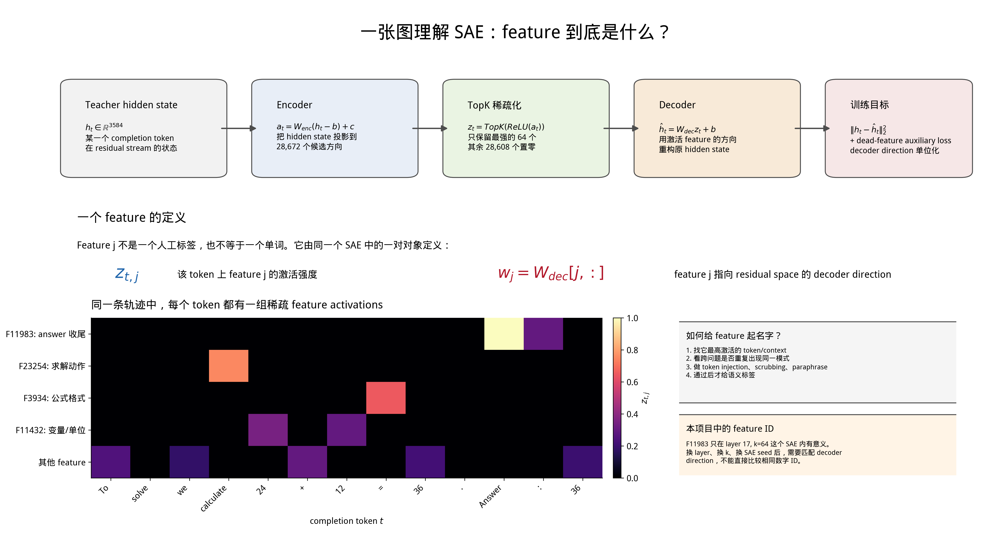
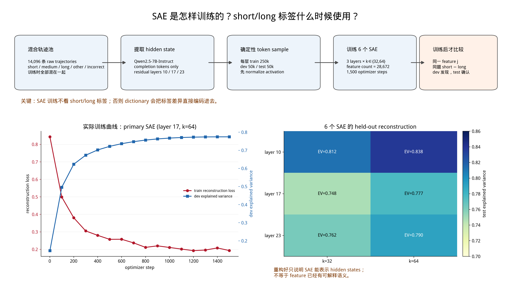
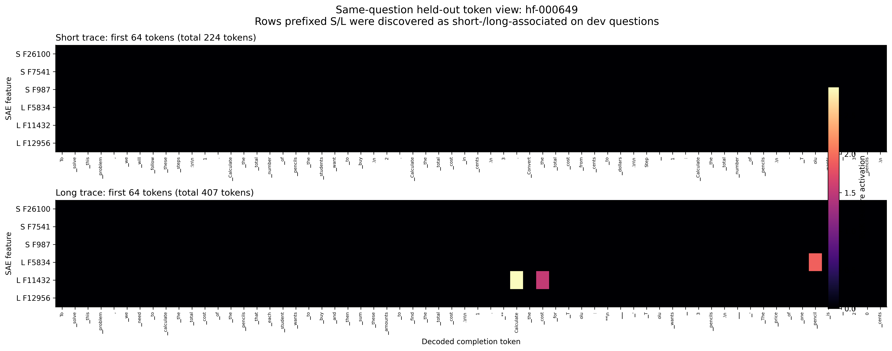
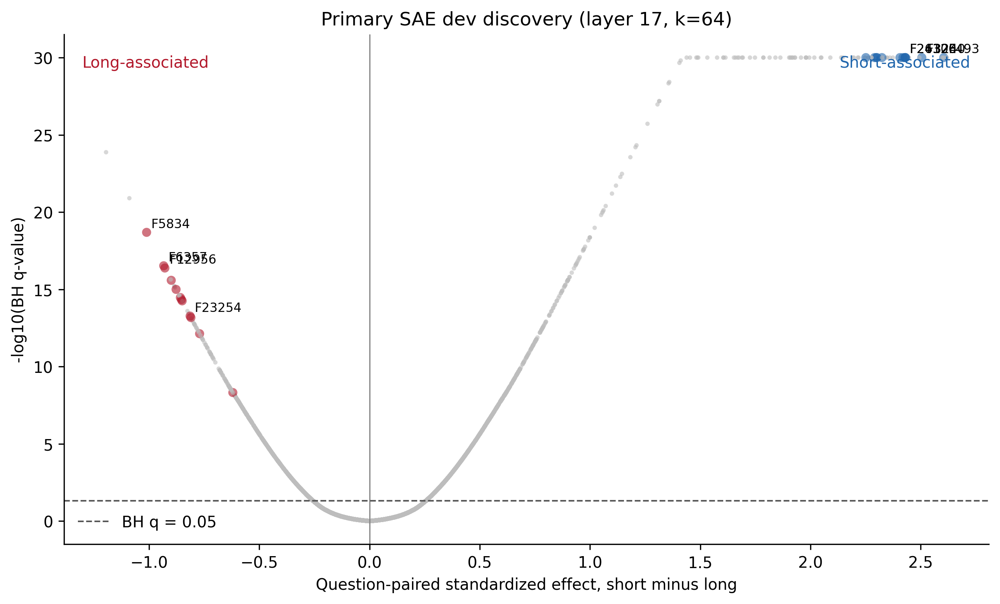
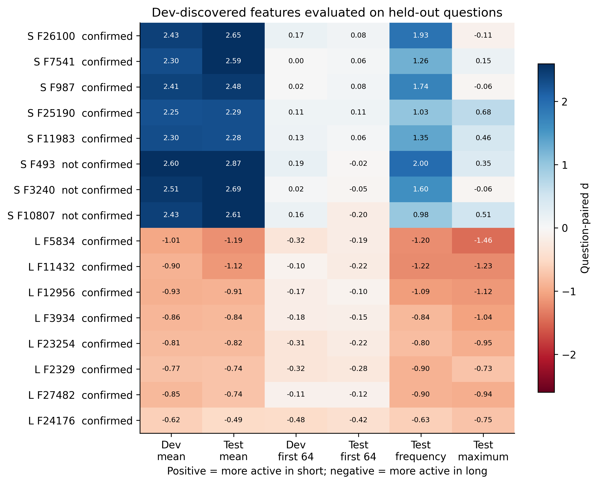
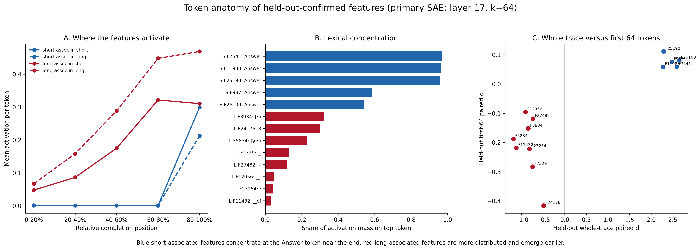
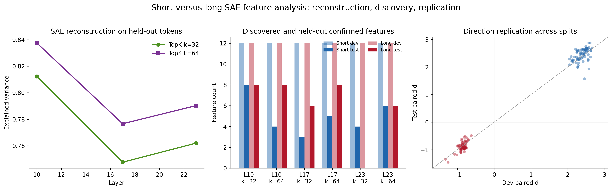
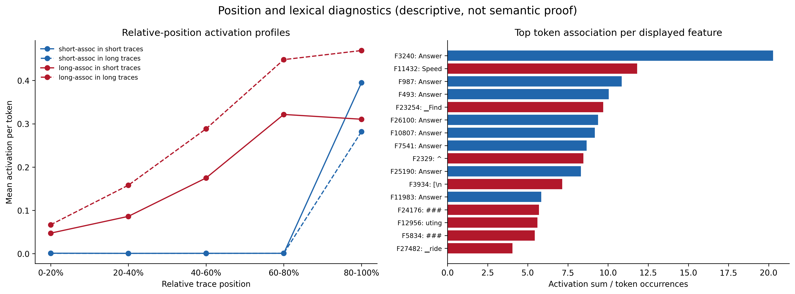
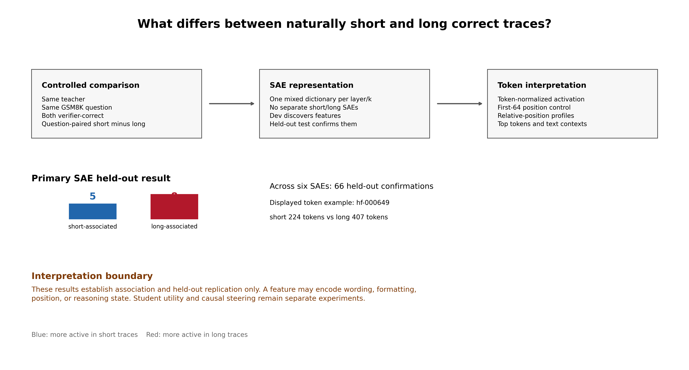

# SAE 如何训练，feature 如何对应到 token：项目图文教程

[English version](sae_training_and_feature_to_token_en.md) · [教程目录](README.md)

本文结合 `SAE_long_short` 的实际代码、训练记录和 `figures/phase2_short_long_feature_analysis_v1` 中的七张图，解释从文本到 SAE feature、再到 token 可视化的全过程。适合知道语言模型逐 token 生成文本、但尚未训练过 SAE 的读者。

**先记住一条主线：SAE 学习把隐藏状态分解成少量 feature 的组合；图上的文字来自原始 token 的位置记录。SAE 的 decoder 输出隐藏向量，语言模型的输出层才负责给词表中的 token 打分。**

本文于 2026-09-05 根据本地代码和已有结果核对。讨论范围是这组 Phase 2 探索性分析；文中的实验数字不代表后续干预或学生训练的结果。即使部分历史产物位于 `formal/`，相应配置仍设置 `formal_claim_allowed=false`。

阅读顺序：先读 1–3 理解训练，再读 4 理解 feature 与 token，最后用 5–7 对照实验图。公式旁都有文字解释；图片可点击打开原图。

## 1. SAE 的输入是什么？

SAE 是 **Sparse Autoencoder，稀疏自编码器**。Autoencoder 的意思是“输入一个向量，再努力重构同一个向量”；Sparse 的意思是“中间表示只允许少数维度非零”。

本项目先把已有的数学解答送入冻结的 Qwen2.5-7B-Instruct，逐层读取模型内部状态。这里叫 replay 或 teacher forcing：完整解答已经存在，模型读取它以提供隐藏状态。模型使用因果注意力，因此解答位置 $t$ 的状态只依赖提示词和截至该位置的文本。

```text
题目 + 已有解答
       │ tokenizer：文本切成 token IDs
       ▼
冻结的 Qwen2.5-7B-Instruct
       │ 读取某一 Transformer block 的输出
       ▼
解答位置 t 的隐藏状态 h_t，形状 [3584]
       │ 作为一个 SAE 训练样本
       ▼
SAE：编码 → 稀疏化 → 重构同一个隐藏状态
```

实际读取的是 **post-block residual**，即一个 Transformer block 运算结束后的残差流向量。层索引为 10、17、23，采用零起始编号，所以 layer 17 是第 18 个 block。每个位置的向量有 3,584 个数。

一条长度为 $T$ 的解答，在某层提供一个 $T\times3584$ 的矩阵。训练 SAE 时，从中抽出的每个 token 位置是一条样本。**同一个 token 字符串出现在不同上下文中，隐藏状态和 feature 激活都可能不同。**

本项目仅保存 completion，也就是解答部分的 token 状态；题目参与模型前向计算，但题目位置不作为这次 SAE 的训练样本。保存隐藏状态时，同时记录 `token_ids`、`trace_indices` 和 `positions`，后面才能找回原文。

代码对应：[状态提取入口](../../scripts/2_2_extract_residual_activations.py)与[激活存储和文本回放](../../src/length_budget_distill/sae_activations.py)。

## 2. 一个 feature 到底是什么？

[]$../../figures/phase2_sae_explainer_v2/01_sae_feature_anatomy_zh.png$

**图 1｜结构示意。** 上半部分表示编码、TopK 和重构。下半部分的 token 热力图由绘图代码手工构造，是教学示意；其中“求解动作”“变量/单位”等名称是解释性假设，不能当作这些 feature 已被验证的语义。图中省略了输入标准化，矩阵的行列记法也作了简化；以下公式按实际实现展开。

可以把 SAE 想成在学习一套“向量积木”：字典里有很多方向，但每次只拿少数几个方向，乘以不同的系数，拼回当前隐藏状态。

对于 feature $j$，要分清三个对象：

- **编号 $j$**：字典里的位置，例如 `F11983`，本身没有语义。
- **激活 $z_{t,j}$**：当前 token 位置上，这个 feature 的非负强度；不同位置会变化。
- **decoder 方向 $d_j\in\mathbb{R}^{3584}$**：该 feature 用来重构隐藏状态的向量；训练结束后固定。

Encoder 的对应权重和偏置负责计算这个 feature 的候选得分；它是否最终激活，还取决于该位置其他 feature 的得分及 TopK 竞争。

本项目把 3,584 维输入编码为 **28,672 维 feature 空间**，扩展倍数为 8。主分析 SAE 使用 $k=64$：每个位置最多 64 个 feature 为正，其余为零。增加中间维度提供了更多候选方向，稀疏约束限制每次能使用多少个。

例如，下面是一组**虚构的小型算例**：

```text
某位置 encoder 的候选得分： [3.0, -0.5, 1.2, 4.0, 0.2]
假设 k = 2：只选最大两项，再做 ReLU
该位置的稀疏表示 z：       [3.0,  0.0, 0.0, 4.0, 0.0]
重构向量：                 b_dec + 3.0 × d_0 + 4.0 × d_3
```

这里 `d_0`、`d_3` 都是向量，并不是两个词。一个 token 可以同时激活多个 feature，一个 feature 也可以在多个 token 和上下文中激活。

**Feature 编号仅在同一个 checkpoint 内有意义。** 换层、换 $k$ 或重新训练后，即使编号相同，也不能假定是同一个 feature。六个 SAE 的 feature 数量可以汇总，但这些编号并没有跨字典自动对齐。

## 3. SAE 实际怎么 train？

### 3.1 准备数据：先分题目，再采样 token

[]$../../figures/phase2_sae_explainer_v2/02_sae_training_and_identification_zh.png$

**图 2｜训练流程与实际记录。** 左下红线是主 SAE 的训练 batch 重构损失，蓝线是 dev explained variance；右下是六个 SAE 的 test 重构结果。红线没有包含辅助损失，不能直接当作总训练 loss。训练池混合各种长度与正确性，但 train、dev、test 的题目仍然分开。

本次数据池有 881 道 GSM8K 题，每题 16 条已有生成解答，共 14,096 条。按题目分成 train 617、dev 132、test 132；同一道题的所有解答属于同一 split，避免同题泄漏。

在每个 split 内，从完整解答的 token 位置做确定性、不放回采样。**每层**用于训练的样本数是 250,000，dev 和 test 各 50,000。同层的 $k=32$ 与 $k=64$ 使用相同采样产物。训练池包含错误解答，不用 short/long 标签优化 SAE。

这里的初始方案按 token 采样：更长的解答拥有更多可抽取位置，预期贡献更多样本。因此“训练不看标签”不意味着“每条长短解答在训练中权重相同”。本教程解释的是这套原始字典，不把后续采样消融结果混入其中。

### 3.2 标准化隐藏状态

只用 train 样本估计均值向量 $\mu$ 和一个标量缩放系数 $s$：

$$
x_t=s(h_t-\mu),\qquad
s=\sqrt{\frac{3584}{\mathbb{E}_{\mathrm{train}}\|h_t-\mu\|_2^2}}.
$$

直观上，先移除训练集的平均状态，再把整体数值尺度调到适合训练的范围。这是整体缩放，不是对每个维度分别除以标准差。Dev、test 复用训练集的 $\mu,s$。

### 3.3 Encoder：把隐藏状态变成候选得分

$$
a_t=W_{\mathrm{enc}}(x_t-b_{\mathrm{dec}})+b_{\mathrm{enc}}.
$$

其中 $W_{\mathrm{enc}}$ 的形状是 $28672\times3584$，所以输出 $a_t$ 有 28,672 个数。这里的 $b_{\mathrm{dec}}$ 是可训练偏置，与上一节由数据估计的均值 $\mu$ 是不同对象。

Encoder 为每个 feature 计算一个候选得分；这些分数没有经过 softmax，不是概率，也不需要加起来等于 1。

### 3.4 TopK：只允许少数 feature 参与重构

令 $I_t$ 是 $a_t$ 中得分最高的 $k$ 个索引：

$$
z_{t,j}=\begin{cases}
\max(a_{t,j},0),&j\in I_t,\\
0,&j\notin I_t.
\end{cases}
$$

代码先 `torch.topk(pre, k)`，再对选出的数值 `ReLU`。因此数学上是**最多** $k$ 个正激活，若选中项非正也会变成零。本次主 SAE 实测 test 平均非零数为 64。

TopK 用结构直接限制稀疏度。本项目的训练目标没有额外的 L1 激活惩罚。这种通过 $k$ 控制稀疏性的 SAE 设计可参考 [Gao 等，Scaling and Evaluating Sparse Autoencoders](https://arxiv.org/abs/2406.04093)；本文具体公式和设置以本地实现为准。

### 3.5 Decoder：用方向的加权和重构输入

$$
\hat x_t=b_{\mathrm{dec}}+\sum_{j\in I_t}z_{t,j}d_j.
$$

代码把所有 $d_j$ 按行保存为 `decoder_weight`，形状为 `[28672, 3584]`。对于一个 batch，等价的稠密表达为 `x_hat = z @ decoder_weight + decoder_bias`；实现只读取被选中方向，避免把整张稀疏矩阵展开。

Encoder 和 decoder 初始化时权重相同，但随后分别训练，并不永久绑定。每个 decoder 方向会保持单位范数；这些方向也不要求两两正交。

### 3.6 Loss 和反向传播：训练的是 SAE 参数

主要损失是重构均方误差：

$$
\mathcal L_{\mathrm{recon}}
=\frac{1}{B\cdot3584}\sum_{t=1}^{B}\|x_t-\hat x_t\|_2^2.
$$

输入是隐藏状态，目标也是该隐藏状态。这里没有 next-token 交叉熵，也没有 short/long 分类损失。教师模型已经提供缓存激活，SAE 优化器只更新 encoder、decoder 及其偏置。

如果某些 feature 长时间从未激活，它们很难通过主重构分支学到东西。项目额外使用 **dead-feature auxiliary loss**：从连续 200 个训练 step 未激活的 feature 中，最多选 256 个，让它们尝试解释主 SAE 尚未重构好的残差 $r=x-\hat x$。辅助分支的残差目标停止梯度，并按残差均方归一化：

$$
\mathcal L_{\mathrm{aux}}
=\frac{\operatorname{mean}[(\hat r_{\mathrm{dead}}-\operatorname{stopgrad}(r))^2]}
{\max(\operatorname{mean}[\operatorname{stopgrad}(r)^2],10^{-8})},
\qquad
\mathcal L=\mathcal L_{\mathrm{recon}}+0.03125\mathcal L_{\mathrm{aux}}.
$$

没有符合条件的 dead feature 时，辅助损失为零。这个机制给未活跃方向学习机会，并不保证所有 feature 都有清晰语义。

一次训练更新可以概括为：

```text
取 256 个缓存隐藏状态 → 标准化
    → encoder 候选得分 → TopK + ReLU
    → decoder 重构 → 重构损失 + 辅助损失
    → 反向传播到 SAE 参数
    → 移除 decoder 梯度沿自身方向的分量，梯度裁剪
    → AdamW 更新，再把 decoder 方向归一化
```

本次每个 SAE 训练 1,500 step，学习率峰值为 `3e-4`，前 100 step warmup，随后余弦衰减；batch size 256，随机种子 17，weight decay 为 0，梯度裁剪范数 1。参数为 FP32，主要前向运算使用 BF16 autocast。每 100 step 评估 dev，每 500 step 保存 checkpoint，最终使用第 1,500 step 的模型。

3 个层与 2 个 $k$ 组合，共训练 6 个独立 SAE。没有另训“short SAE”和“long SAE”；比较长短解答时使用同一套字典。

### 3.7 怎么知道训练学到了什么？

主 SAE，即 layer 17、$k=64$，保存记录显示：

- 训练 batch 重构 MSE 从 step 1 的约 **0.843** 降到 step 1500 的约 **0.193**；末步总 loss 为约 **0.224**，因为还包含辅助项。
- 最终 test MSE 为 **0.2232**，explained variance 为 **0.7766**。
- Test 平均每 token 有 **64** 个非零 feature；约 **0.122%** 的 feature 在这批 test 样本中没有激活。

这里的 explained variance 计算为 $1-\sum\|x-\hat x\|^2/\sum\|x-\bar x_{\mathrm{eval}}\|^2$。约 0.777 表示在这一重构指标下解释了约 77.7% 的隐藏状态变异，不能读作“数学准确率为 77.7%”。最后一项是 test 样本内的未激活比例，也不同于训练时按 200 step 窗口判断的 dead feature。

数据来源：[训练指标](../../results/phase2_sae_pilot_v1/formal/sae_training/layer_17_k_064/training_metrics.json)、[六个 SAE 的汇总](../../results/phase2_sae_pilot_v1/formal/audit/sae_metrics.csv)。重构质量回答的是表示是否保留了输入信息；feature 是否容易解释、能否改变生成行为，还需要另外验证。

## 4. Feature 是怎么“变成 token”的？

### 4.1 在这些分析图里：查回激活发生时的 token

图中 `F11983: Answer` 的生成过程如下：

```text
原始解答某位置的 token ID ───────────────────┐
        │                                   │
        ▼                                   │
教师模型在该位置的隐藏状态 h_t               │
        │ 标准化，再经过 SAE encoder         │
        ▼                                   │
得到 feature ID j 和激活强度 z_tj            │
        │ 按 trace_id + position 对齐        │
        └───────────────────────────────────┤
                                            ▼
保存事件：(feature_id, activation, token_id, position, trace_id)
                                            │
                          tokenizer 将 token_id 显示为文字
                                            ▼
                              token 热力图、top token 和上下文
```

这一步用的是**位置对齐和词表查找**。Tokenizer 解释的是 `token_id`；把 `feature_id` 直接传给 tokenizer，只会碰巧查到同编号的词表项，没有 feature 解释意义。

下面是一条从主 SAE 的 test 事件文件中读出的真实记录，保留了用于定位的字段：

```json
{
  "trace_id": "hf-000026:qwen2p5_7b:unconstrained_sample_pool:candidate_02",
  "analysis_length_label": "long",
  "feature_id": 11983,
  "position": 301,
  "token_id": 16141,
  "activation": 5.75
}
```

其中 `position=301` 是从零开始的第 302 个 completion token；`token_id=16141` 在本项目 tokenizer 中对应 `Answer`。于是可表述为：**这条长解答读到 `Answer` 的位置，F11983 的激活强度是 5.75。**

注意，这个 short-associated feature 也出现在 long 解答中。Short-associated 表示一种群体统计差异，不表示只有短解答才允许它激活。

事件来源：[selected_feature_token_events.jsonl](../../results/phase2_short_long_feature_analysis_v1/exploratory/feature_scores/layer_17_k_064/selected_feature_token_events.jsonl)。想看完整文字窗口，可读 [token_contexts.md](../../results/phase2_short_long_feature_analysis_v1/exploratory/analysis/token_contexts.md)。

### 4.2 Token 热力图的每个格子是什么？

[]$../../figures/phase2_short_long_feature_analysis_v1/04_same_question_token_heatmap.png$

**图 3｜真实案例 `hf-000649`。** 上面是总长 224 token 的短解答，下面是总长 407 token 的长解答；两边只显示各自开头 64 个 token。横轴是原文 token，纵轴是选出的 feature，颜色是对应位置的非负激活 $z_{t,j}$。`S`/`L` 表示 dev 上发现的关联方向；统计确认状态应查图 5 或结果 CSV。

读一个亮格子：沿纵轴找到 feature，再沿横轴找到这个位置的 token，即可说“这个 feature 在这个上下文位置有较强激活”。黑色通常表示该 feature 此处为零；它不表示教师的隐藏状态为零，也不表示所有其他 feature 都未激活。

上下图的第 $t$ 列是各自第 $t$ 个 token，不是自动匹配好的同义词或推理步骤。开头 64 token 内 short-associated 行几乎不亮，与它们更集中于解答末尾的观察一致；单个案例本身不构成统计证明。

图中 `▁` 等标记用于显示空格，`\n` 表示换行。Token 可能是完整词、子词、数字、标点或多个格式字符，不能把每个 token 都当成一个自然语言单词。

### 4.3 “Top token”有两种统计口径

**平均激活口径**问的是：某个 token 出现时，这个 feature 平均有多强？

$$
\mathrm{conditional\_mean}_j(v)
=\frac{\sum_{t:\mathrm{token}_t=v}z_{t,j}}{\#\{t:\mathrm{token}_t=v\}}.
$$

分母包含该 token 出现但 feature 未激活的情况。原图 `05` 按指定 short/long 组统计，并要求 token 至少出现 8 次。

**激活总量占比口径**问的是：这个 feature 的所有激活总量，有多少来自某个 token？

$$
\mathrm{mass\_share}_j(v)
=\frac{\sum_{t:\mathrm{token}_t=v}z_{t,j}}{\sum_tz_{t,j}}.
$$

原图 `07` 对 test 的 short/long 事件合并后使用这一口径。高频 token 可能占据大量总激活，即使单次激活不是最强。因此两张图的 top token 不同并不矛盾；占比也不是“输出该 token 的概率”。

### 4.4 如果真要让 feature 影响模型生成呢？

这需要经过隐藏状态和语言模型的后续计算。下面是单 feature 加性干预的**原理说明**，并不是本文已经验证了该干预效果：

$$
h'_t=h_t+\frac{\Delta z_j}{s}d_j.
$$

因为 decoder 方向处于标准化空间，回到原始隐藏状态时要除以 $s$。这条公式把原状态中 SAE 未能重构的残差保留下来。另一种做法是把完整 SAE 重构反标准化为 $\hat h_t=\hat x_t/s+\mu$，但这样也引入了重构误差，两者不能混为一谈。

```text
改变 feature 对应方向的强度
        ↓ decoder 方向换回原隐藏状态尺度
修改某层残差流 h_t
        ↓ 后续 Transformer blocks
最终归一化 → LM head → 整个词表的 logits
        ↓ softmax 得到概率，按生成策略选择
下一个 token ID → tokenizer 显示为文本
```

尤其要区分时间位置：在 `Answer` token 位置观察到 F11983 强激活，描述的是模型**已经读入 `Answer` 后**的状态；该位置的后续输出通常用于预测下一个 token。它并不直接说明 F11983 导致模型生成了当前的 `Answer`。

中间层方向必须经过后续网络才能影响词表分数。即使把 decoder 方向投影到 LM head 看词表排序，也只是近似诊断，不能代替真实前向传播和干预评估。本教程中的 token 标签来自 4.1 的原文对齐，不来自这种投影。

## 5. Short feature 和 long feature 是怎么找出来的？

SAE 训练好后才使用长短标签。每道题的正确解答中，最短的约 20% 标为 short，最长的约 20% 标为 long，具体数量按向上取整；错误解答参与前面的字典训练，但不进入这里的正确 short/long 配对比较。

先给每条轨迹算 feature 的平均激活：

$$
A_{r,j}=\frac{1}{T_r}\sum_{t=1}^{T_r}z_{r,t,j}.
$$

再在同一道题内，分别平均 short 轨迹与 long 轨迹，并相减：

$$
\Delta_{q,j}=\operatorname{mean}_{r\in\mathrm{short}(q)}A_{r,j}
-\operatorname{mean}_{r\in\mathrm{long}(q)}A_{r,j}.
$$

最后在题目之间计算标准化配对效应 $d_j=\operatorname{mean}_q\Delta_{q,j}/\operatorname{sd}_q\Delta_{q,j}$。正值表示短解答平均更活跃，负值表示长解答平均更活跃。推断单位是题目，不能把成千上万个相关 token 当作独立样本。

**Dev 发现，test 确认。** Dev 优先选择满足出现比例至少 5%、BH 校正 $q\le0.05$、主指标 |d| 至少 0.2、全篇与前 64 token 方向一致的 feature，每个方向最多选 12 个候选。实现允许用未通过全部 discovery gate 的候选补足名额，因此阅读候选文件时还要区分 `passes_discovery_gate`。

Test 对候选的主指标做 Holm 校正，要求校正后 $p\le0.05$、主指标 |d| 至少 0.15，并要求全篇及前 64 token 的方向都复现。前 64 token 项在该确认规则中是**符号一致性要求**，没有另设显著性门槛；“confirmed”不能理解为已彻底排除了位置或词汇影响。

[]$../../figures/phase2_short_long_feature_analysis_v1/02_primary_sae_discovery_volcano.png$

**图 4｜先看方向，再看显著性。** 横轴是 short 减 long 的配对效应 $d$：右侧偏 short，左侧偏 long。纵轴是负对数 BH q 值，越高表示 dev 上的统计证据越强；它不是 feature 激活强度。显著性高不自动意味着语义清晰。

[]$../../figures/phase2_short_long_feature_analysis_v1/03_heldout_feature_validation.png$

**图 5｜检查是否在未用于发现的题目中复现。** 每行是一个 feature，每列是不同 split 或汇总指标上的配对 $d$，不是原始 token 激活。蓝色表示 short 更强，红色表示 long 更强。`mean` 包含未激活位置的零，`frequency` 是正激活比例，`maximum` 是每条轨迹的最大激活。

例如 F493 的 test 全篇 $d\approx2.87$，但前 64 token 为约 −0.02，方向翻转，所以没有确认。F11983 的 test 全篇 $d\approx2.275$，前 64 token 只有约 0.059；后者符合符号要求，但效应很小。

## 6. 用真实结果理解：F11983 为什么显示为 Answer？

[]$../../figures/phase2_short_long_feature_analysis_v1/07_confirmed_feature_token_anatomy.png$

**图 6｜这张图最直接回答 feature 与 token 的关系。** A 看激活在解答什么位置出现；B 看总激活是否集中在一个 token；C 比较全篇与前 64 token 的配对效应。

对于 layer 17、$k=64$ 的 F11983，已有 test 事件统计显示：

- 最大激活总量对应的 token 是 `Answer`，词表 ID 为 **16141**。
- **96.35%** 的激活总量落在这个 token 上。
- 全篇平均激活的 short-minus-long 配对 $d\approx2.275$，前 64 token 的 $d\approx0.059$。

因此目前合理的描述是：“F11983 在这批解答中与 `Answer` token 及结尾区域高度相关，按全篇 token 平均后在 short 组更强。”把它命名为“简洁推理能力”或“控制回答长度的开关”，需要超出这些图的证据。

为什么即使两边都有 `Answer`，它仍可能 short-associated？看一个**纯教学算例**：假设两条解答都只在 `Answer` 处激活一次，强度都是 6；短解答长 100 token，长解答长 300 token，则全篇均值分别为 $6/100=0.06$ 和 $6/300=0.02$。只因相同的结尾激活被不同长度平均，就能产生 short-minus-long 差异。

这个算例展示的是一种可能机制，不能断言它解释了全部观察。实际图 A 的末尾集中、图 B 的词汇集中，以及图 C 中很小的 early effect，共同提示应认真检验结尾格式与长度归一化的影响。

其他真实例子也说明 feature 与 token 是多对多关系：F7541 的激活总量约 **96.99%** 来自 `Answer`；F5834 最集中的 token 为 `]` 后接两个换行，占约 **22.84%**；F11432 最集中的 token 为带前导空格的 `of`，只占约 **3.27%**。分散程度不同，但分散本身也不能证明它表示更抽象的推理概念。

精确数字见 [confirmed_feature_token_summary.csv](../../results/phase2_short_long_feature_analysis_v1/exploratory/supplementary_token_analysis_v1/confirmed_feature_token_summary.csv)。

## 7. 其余三张分析图应该怎么读？

[]$../../figures/phase2_short_long_feature_analysis_v1/01_sae_feature_difference_overview.png$

**图 7｜总体概览，对应原文件 01。** 左图比较重构质量：本次 $k=64$ 的 EV 高于同层 $k=32$，说明允许更多非零方向改善了重构，但不能据此判定 feature 语义更好。中图对比 dev 候选和 test 确认数量。右图比较两个 split 的效应方向与大小。六个 SAE 合计有 **66 个字典内 feature 的确认记录**；这不是跨字典去重后的 66 种独立概念。

[]$../../figures/phase2_short_long_feature_analysis_v1/05_token_and_position_diagnostics.png$

**图 8｜位置与词汇诊断，对应原文件 05。** 左图按相对长度分成五段，所以不同长度解答的 80–100% 区间都有结尾。右图按 token 出现次数归一化，采用 4.3 的条件平均口径，显示集合还包含未确认候选，例如 F493、F3240。原文件 07 则只保留已确认 feature，并用激活总量占比，所以应分别解释。

[]$../../figures/phase2_short_long_feature_analysis_v1/06_short_long_feature_story.png$

**图 9｜分析流程，对应原文件 06。** 主 SAE 有 **5 个 short-associated、8 个 long-associated** feature 通过该 held-out 规则。图中的数量支持“在同题、正确解答比较中发现可复现的激活关联”。这些 Phase 2 图本身没有给出学生效用或生成长度干预结论；后续阶段的实验需单独阅读其协议和结果。

要进一步解释一个 feature，可检验：同义改写后是否保留激活；替换 `Answer` 或改动公式格式后是否消失；匹配长度、位置和词汇后关联是否还在；干预该方向时长度、正确率和输出格式如何一起变化。前两类检验帮助辨别词面与语义，最后一类才直接研究生成中的因果效果。

## 8. 对照代码时，从哪里开始？

下面按数据流列出入口。前面的正文已经解释计算含义，阅读代码时可以只追踪自己关心的一段。

| 要理解的环节 | 项目文件 |
|---|---|
| 本次数据、层、采样和训练超参数 | [冻结 SAE 协议](../../results/phase2_sae_pilot_v1/formal/protocol/frozen_protocol.json) |
| 混合解答语料 | [2_1_build_sae_corpus.py](../../scripts/2_1_build_sae_corpus.py) |
| 回放文本，保存隐藏状态和 token 位置 | [sae_activations.py](../../src/length_budget_distill/sae_activations.py) |
| 构建 token 样本和 normalizer | [2_3_build_sae_token_samples.py](../../scripts/2_3_build_sae_token_samples.py) |
| Encoder、TopK、decoder、辅助损失 | [topk_sae.py](../../src/length_budget_distill/topk_sae.py) |
| 训练循环、学习率、保存 checkpoint | [2_4_train_topk_sae.py](../../scripts/2_4_train_topk_sae.py) |
| 编码已有激活、汇总统计、保存 token 事件 | [2_8_score_short_long_features.py](../../scripts/2_8_score_short_long_features.py) |
| 同题配对统计与 dev 候选选择 | [sae_feature_analysis.py](../../src/length_budget_distill/sae_feature_analysis.py) |
| 原分析图 01–06 和上下文报告 | [2_10_analyze_short_long_features.py](../../scripts/2_10_analyze_short_long_features.py) |
| 原分析图 07 与 token 总量占比 | [2_12_render_confirmed_feature_token_anatomy.py](../../scripts/2_12_render_confirmed_feature_token_anatomy.py) |

可以用下面这段只读代码找出 F11983 激活最高的若干 token 事件，不需要重新训练或加载教师模型：

```bash
cd /home/youyang7/projects/SAE_long_short
/home/youyang7/.conda/envs/sft/bin/python - <<'PY'
import heapq
import json
from pathlib import Path

event_path = Path(
    "results/phase2_short_long_feature_analysis_v1/exploratory/"
    "feature_scores/layer_17_k_064/selected_feature_token_events.jsonl"
)
with event_path.open(encoding="utf-8") as handle:
    rows = (json.loads(line) for line in handle)
    selected = (row for row in rows if row["feature_id"] == 11983)
    top = heapq.nlargest(5, selected, key=lambda row: row["activation"])
for row in top:
    print(json.dumps(row, ensure_ascii=False))
PY
```

输出的是 `feature_id`、`token_id`、激活与原文位置。结合 [token 上下文报告](../../results/phase2_short_long_feature_analysis_v1/exploratory/analysis/token_contexts.md) 阅读，就能完整走通“隐藏状态 → feature 激活 → 原文 token”的解释路径。
